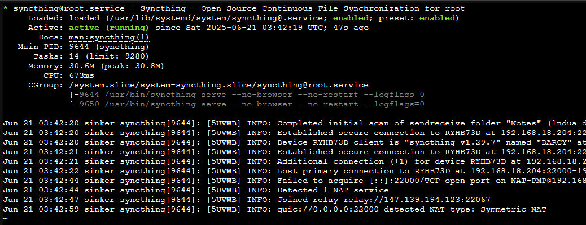
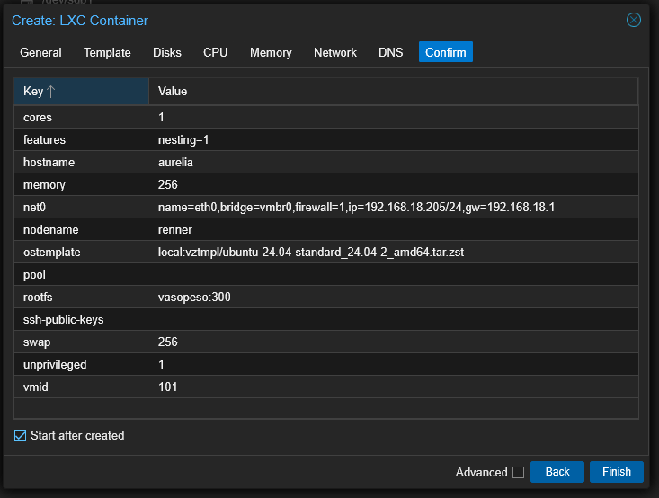
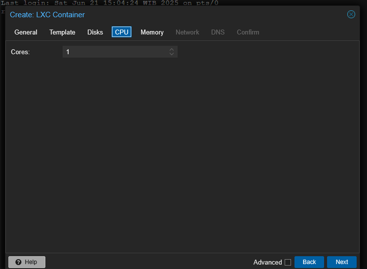
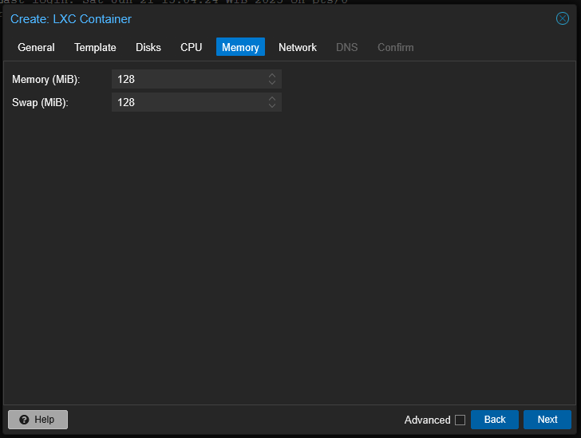
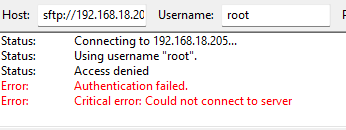
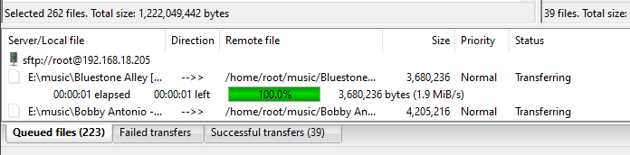

+++
date = '2025-06-21T10:45:12+07:00'
draft = false
title = 'Home Lab Revamp Part 2'
tags = ['indonesia', 'homelab']
+++
## Kata Pengantar
Oke kita sekarang udah berhasil jalanin Syncthing dengan buat sesi tmux. Masalahnya kalau mati listrik aku perlu buat sesi tmux, trus jalanin `syncthing serve` lagi. Malas

## Setting autostart syncthing
Sebab itu aku cari cara supaya syncthing bisa autostart semisal container-ku nyala lagi. Aku ikutin [dokumentasinya](https://docs.syncthing.net/users/autostart.html#linux) dan _user_-nya aku pakai **root**. Jangan ditiru kawan-kawan, sebaiknya kalian buat user baru untuk syncthing. Karena aku install via apt, aku bisa langsung skip ke step nomor 3.

`systemctl enable syncthing@root.service`
`systemctl start syncthing@root.service`

Habis itu aku tinggal cek aja jalan atau engga dengan

`systemctl status syncthing@root`

Dan aku cross-check dengan melihat koneksi PC-ku dengan sinker(nama container dan hostname Syncthing-nya)

## Ubur-Ubur
Aku punya hobi buat _hoarding_ film. Aku download dan simpan di _harddisk_ (jarang-jarang juga nontonnya) tapi seneng aja gitu bahwa faktanya aku menyimpan hal yang aku sukai. Sekarang aku mau supaya RENNER nyimpen _film-film_ ku sebagai bentuk dari _backup_ dan biar aku bisa streaming via HP. Pegel juga nih punggung kalau duduk di depan komputer terus. Aku nemu yang namanya Jellyfin, sebuah media server. Aku mulai _googling_ buat cari-cari [dokumentasi cara install](https://jellyfin.org/docs/general/installation/linux) Jellyfin, termasuk perbandingan antara Jellyfin dan Plex. 

Setelah aku coba set container aku baru sadar bahwa...bahwa _harddisk_ yang kemarin aku bergulat dengannya untuk membuat partisi ternyata belum terbaca sebagai LVM (Logical Volume Manager). Simpelnya, harddisk-ku bisa kebaca di _Proxmox_-nya tapi engga bisa kebaca kalau aku buat CT baru. Aku perlu bergulat lagi dengan harddisk ini. 

Ternyata ada GUI untuk buat LVM (Thank, God). Langsung aja aku buat dan pilih partisi yang kubuat kemaren.

Trus langsung aja aku buat CT baru, kita masih pakai Ubuntu di sini (terlanjut nyaman). Hostname-nya kubuat aurelia karena ubur-ubur yang kutahu itu nama latinnya Aurelia aurita. Kenapa jadi ubur-ubur? Yaa karena nama aplikasi yang kupake Jellyfin

Dan baru aja pertama kali install udah dapet error

`TASK ERROR: unable to create CT 101 - lvcreate 'vasopeso/vm-101-disk-0' error:   Volume group "vasopeso" has insufficient free space (71525 extents): 76800 required.`

Asumsiku ini karena aku allocate 300GB di CT dan itu terlalu mepet karena partisiku juga 300GB. Setelah aku FAFO lagi, ternyata 278 bisa. Nanti aku coba cari cara deh buat expand storage-nya. Aku juga set memory dan swap jadi 256 GB aja. Ini 8GB dari physical memory-ku udah kepake 20% pas jalanin sinker, jadinya aku cukup concern.

Error kedua😡😡😡

Oke mungkin ini karena aku set-nya LVM dan aku notice bahwa di sinker aku pakai LVM-thin, yaudah aku cobain pakai LVM-thin.

Pas buat aku dapet error lagi

Aku coba wipe-disk, buat jadi GPT, buat partisi dengan ruang 350GB dan coba buat LVM-thin lagi.

Fast forward setelah mencoba berkali-kali, mengunjungi berapa situs, dan aku menemukan kemungkinan bahwa [harddisk-ku mungkin rusak](https://www.reddit.com/r/Proxmox/comments/11pstsb/check_of_pool_pvedata_failed_status1_manual/) Padahal juga baru beli. Tapi pas beli pertama kali sebenerjua aku udah curiga soalnya S.M.A.R.T-nya ga muncul. Dan pas aku coba cari-cari lagi, aku nemu [ini](https://www.hdsentinel.com/how_to_detect_fake_pendrive_memory_card.php)

> Typical fake pendrives/SSDs may show very generic model ID on the Information page, with no real information about the manufacturer or the model. Very typical fake SSDs may show VendorCo ProductCode, General UDisk, or just SSD but with no further details. Also they may show very generic vendor/product identifiers, for example VID: 048D, PID: 1234, VID: 048D, PID: 1111 or something similar. It is common that these fake pendrives/SSDs do not report any kind of health / temperature information (no S.M.A.R.T. attributes reported, so the S.M.A.R.T. page is completely empty).

I guess I'm cooked but let's not be a pessimist. Aku sebenernya mau coba _surface test_ tapi Sentinel-ku engga berbayar. Yaudah mending aku coba ngurusin yang lain yaitu buat _Navidrome_.

## Navidrome
Untuk yang kali ini aku tinggal buat CT baru. Begini konfigurasi CT-ku

Pas CT-nya udah jalan aku buat directory baru

`mkdir /home/root/music`
`chmod -R 777 /home/root/music`

Oke abis itu tinggal install Navidrome dan ngikutin dari [dokumentasinya](https://www.navidrome.org/docs/installation/linux/)

Pas waktu konfigurasi `navidrome.toml` aku ubah jadi seperti ini.

Pas udah jalan aku coba visit IP address yang udah aku set dan port 4533.

Berhasil! Yaaay, agak aneh juga sih rasanya. Ini pertama kali setting langsung berhasil, hahahaha. Setelah buat username dan password, aku tinggal nambahin musik yang kusimpen di PC dan mindahin ke Oasis (nama CT yang ngejalanin Navidrome).

Pas aku mau konek FileZilla aku kena error

Yeah, itu tidak terhindarkan sih. Aku baru ingat bahwa aku perlu PermitLoginRoot or something, untungnya itu ada di blog sebelumnya. 

Setelah kucoba lagi bisa konek dan sekarang aku perlu nungguin.

## YT-DLP
Nah, sekarang aku mau install yt-dlp. Biar aku bisa download musik dari YT via command line. Seperti biasa aku ikutin dokumentasinya buat instalasi. Dan sat-set-sat-set, udah selesai

Sekarang kalau aku mau nambahin musik ke Oasis, aku perlu login ssh, cd, habis itu jalanin yt-dlp -f 140 $URL-YOUTUBE. 

## Penutup
Sekarang aku udah bisa denger musik di PC via web, di HP-ku (Android) aku tinggal download client yang namanya "Substreamer", masukin ip_address, username, password dan udah bisa dengerin musiknya.

Sekarang mungkin aku bakal cari harddisk yang lebih terpercaya (aku masih mau nonton film dan setting NAS) dan cari cara supaya home-labku bisa diakses di luar network di rumahku. Mungkin aku bakal pakai VPN atau Tailscale atau ada settingan lain yang lebih GG dan aku engga tahu. Nanti coba kucari, ciao.