+++
date = '2025-06-25T12:20:43+07:00'
draft = false
title = 'Home Lab Revamp Part 3'
+++
## Sink In
Saya perlu merogoh kocek yang lumayan untuk membeli harddisk baru karena yang lama ternyata palsu. Yang baru menghabiskan sekitar 300 ribu rupiah termasuk enclosure dan pemasangan.

Setelah saya coba hubungkan ke port USB, saya bisa merasakan "detak jantung" dari harddisk itu. Yang saya maksud detak jantung adalah perputaran atau rotasi dari cakram harddisk. Harddisk saya yang bohong-bohongan itu, yang bahkan sejak saya hidupkan tidak pernah saya merasakan detaknya. Ini penampakannya, by the way.

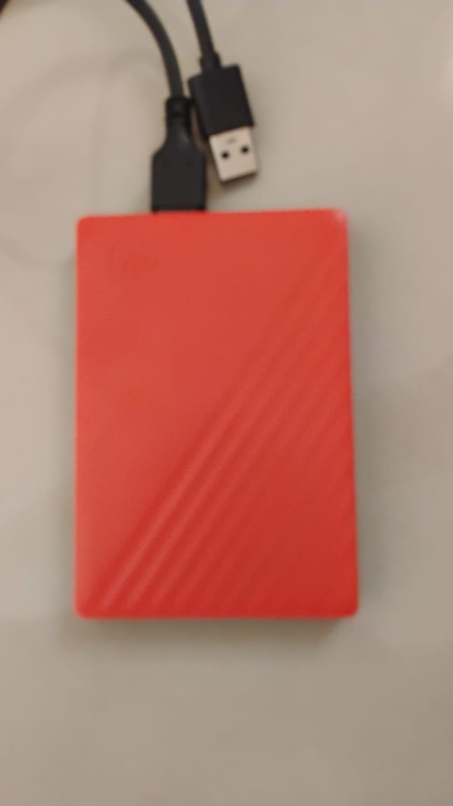

Dan ini adalah penambahkan harddisk yang baru (lagi)

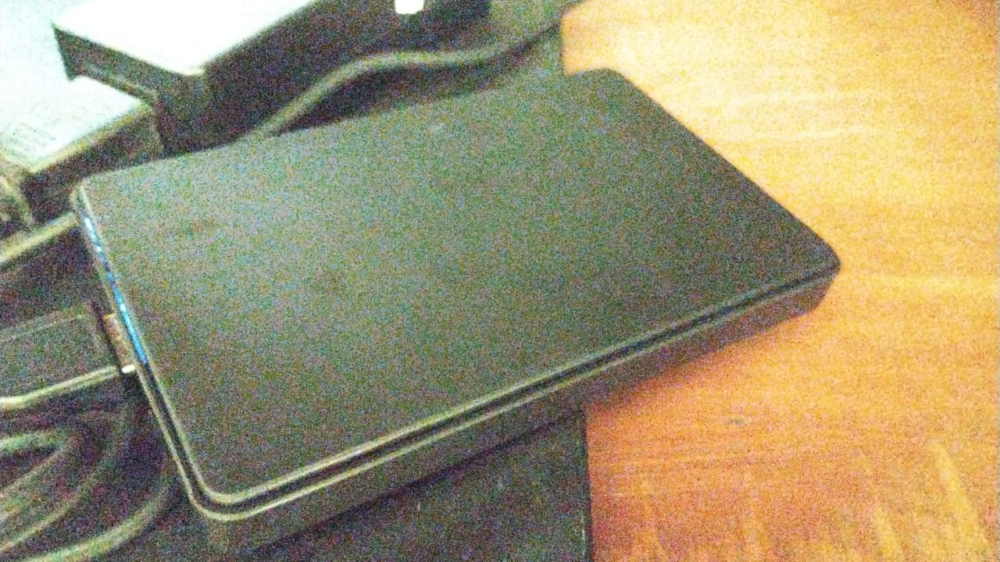

Oke setelah saya sambungkan langsung muncul sebagai /dev/sdb

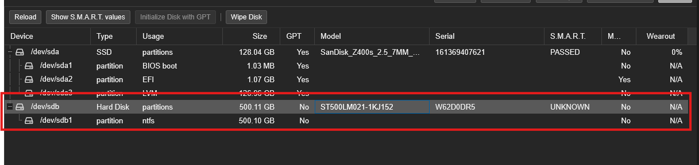

Dan saatnya kita melakukan setup untuk Jellyfin. Saya akan mendedikasikan 1 harddisk berukuran 500GB (iya, saya mau tidak mau perlu menurunkan kapasitas dari intensi saya awalnya karena uang saya tidak cukup) sebagai media penyimpanan film saya.

## Setup Harddisk
Pertama kali saya membeli, harddisk sudah diformat dan dibuatkan partisi oleh Mas-Mas penjaga toko komputernya. Itulah kenapa partisinya itu NTFS. Saya akan wipe harddisk-nya dan menjadikannya sebagai LVM

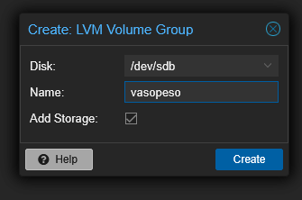

## Setup CT
Saya bakal coba pakai Container lagi untuk menjalankan Jellyfin

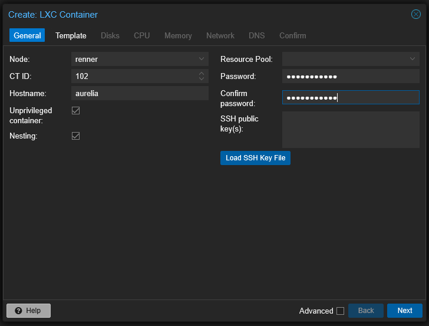

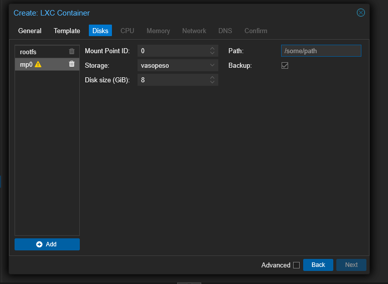

Dan saya bingung apa yang harus saya isi di Path. Namun saya menemukan [video ini](https://youtu.be/qa2Q7tZVol8?si=GWid4YnPQz3umZ2l&t=150) dan saya bisa menyimpulkan bahwa saya cuma perlu buat Path yang masuk akal. 

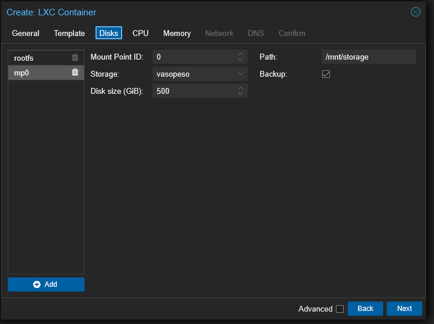

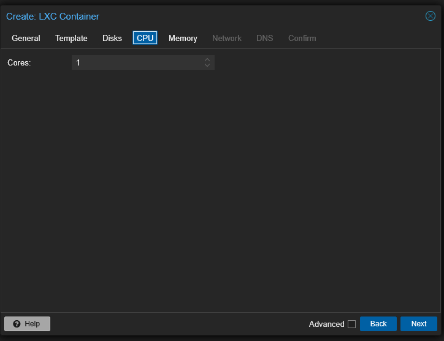

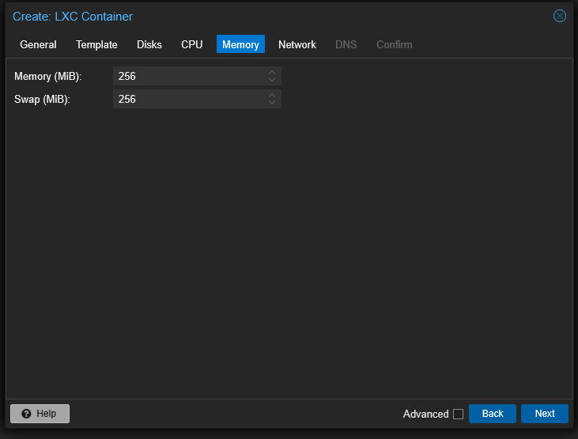

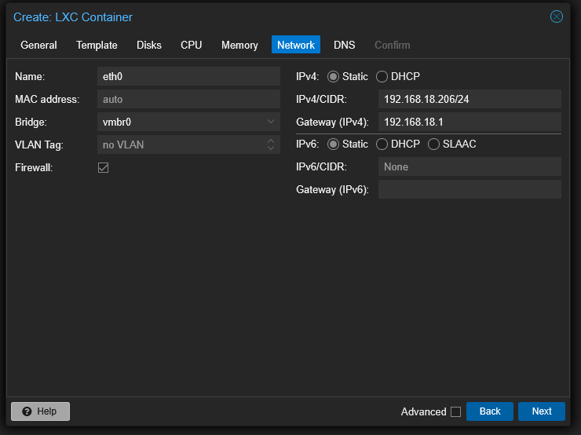

Dan kita mendapatkan error pertama.

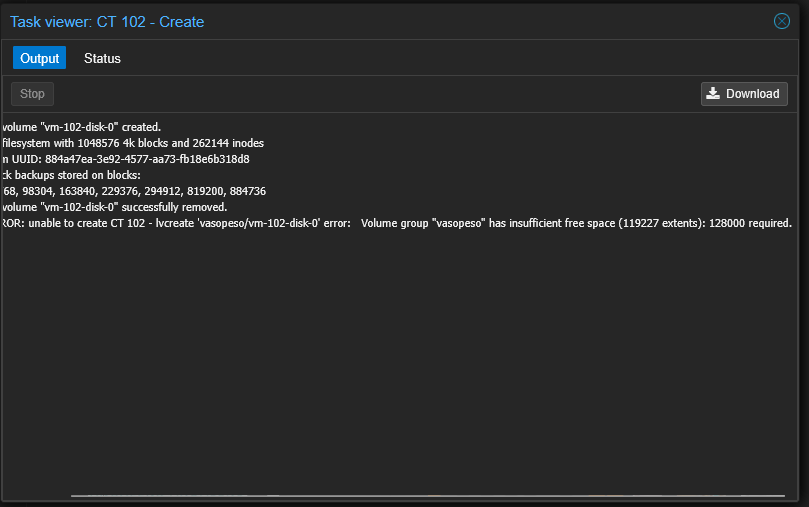

Dan setelah mengatur storage dari 500 GB ke 465 GB, kita akhirnya berhasil.

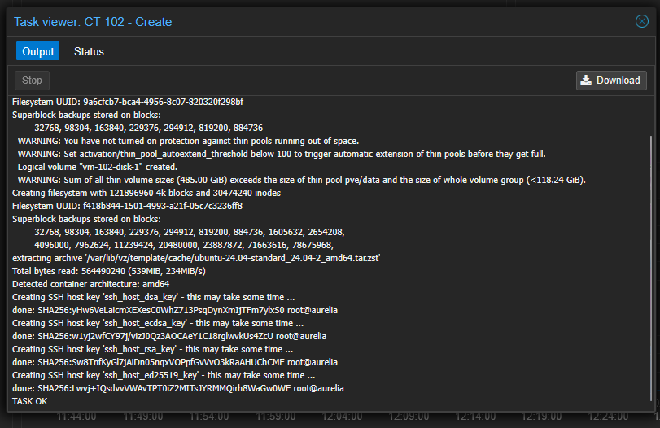

Oke yang saya ingin kalian tahu adalah harddisk ini memiliki kapasitas 500GB, Gigabytes, sedangkan untuk konfigurasi ditanyakan GiB atau Gibibytes. 500GB itu setara dengan sekitar 465GiB.

## Buat User Baru

Saya tidak mau mengulangi awur-awuranku seperti kemarin jadi saya memutuskan untuk membuat user baru yang menjalankan Jellyfin, bukan root yang menjalankannya. Saya juga mau user baru ini masuk ke grup sudoers. Untuk itu saya perlu browsing dan menemukan 2 tutorial yang membantu

- https://phoenixnap.com/kb/linux-adduser
- https://phoenixnap.com/kb/how-to-create-sudo-user-on-ubuntu

Voila! Begini hasil command-lineku

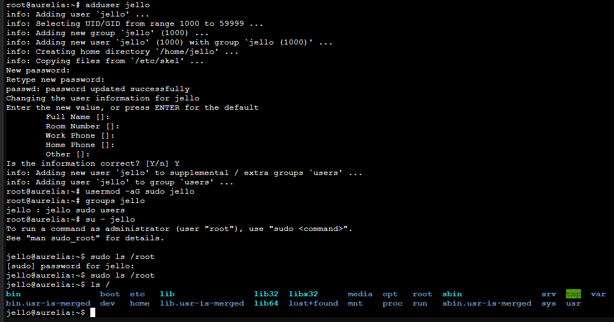

## Instalasi Jellyfin

Di [dokumentasi instalasi](https://jellyfin.org/docs/general/installation/linux#debian--ubuntu-and-derivatives), saya perlu menggunakan curl tapi saat kuinstall saya mendapat error.

`E: Could not open lock file /var/lib/dpkg/lock-frontend - open (13: Permission denied)
E: Unable to acquire the dpkg frontend lock (/var/lib/dpkg/lock-frontend), are you root?`

Oke, saatnya mencari info lagi...ternyata saya belum menambahkan `sudo`...

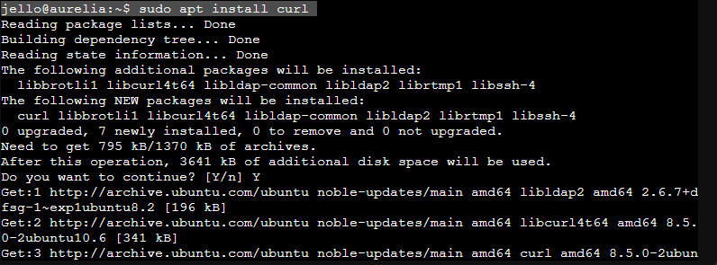

Sekarang saatnya menjalankan command untuk instalasi.

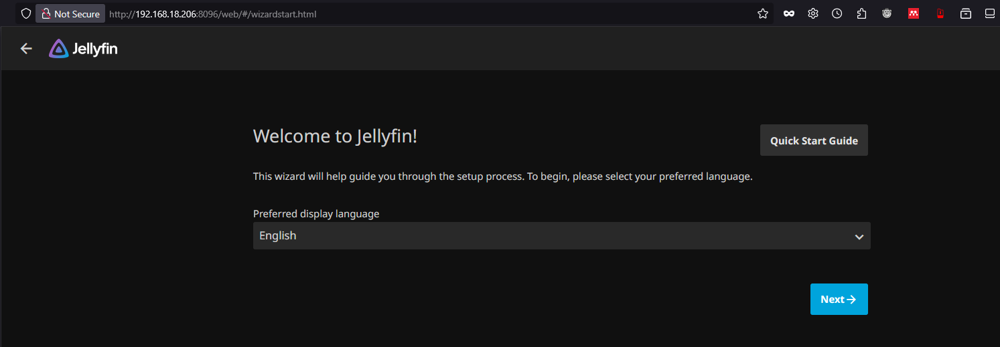

YESSSS.

## Konfigurasi Awal

Sorry, saya lupa untuk screenshot waktu konfigurasi GUI tadi, tetapi kurang lebih saya diminta untuk buat username, password, dan konfigurasi media library. Saya langsung menyalin file film dari PC ke Aurelia (CT yang saya buat)

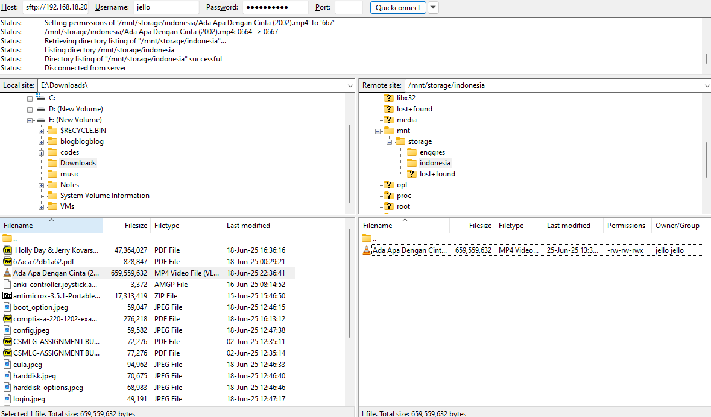

Masalahnya, film itu tidak terdeteksi di Media Library dan ternyata Path dari media library itu salah.

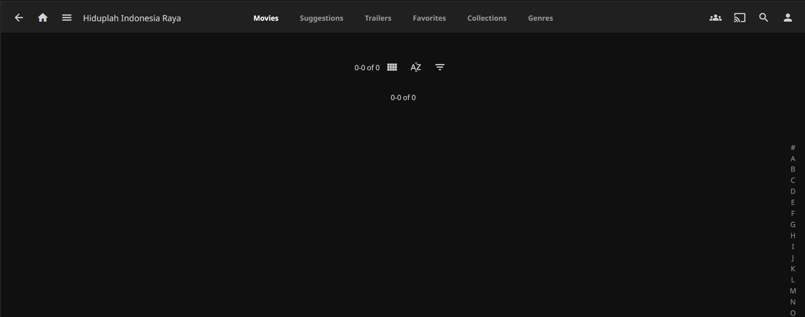

Dan ternyata setelah melakukan scan, film AADC langsung muncul. YAAAY.

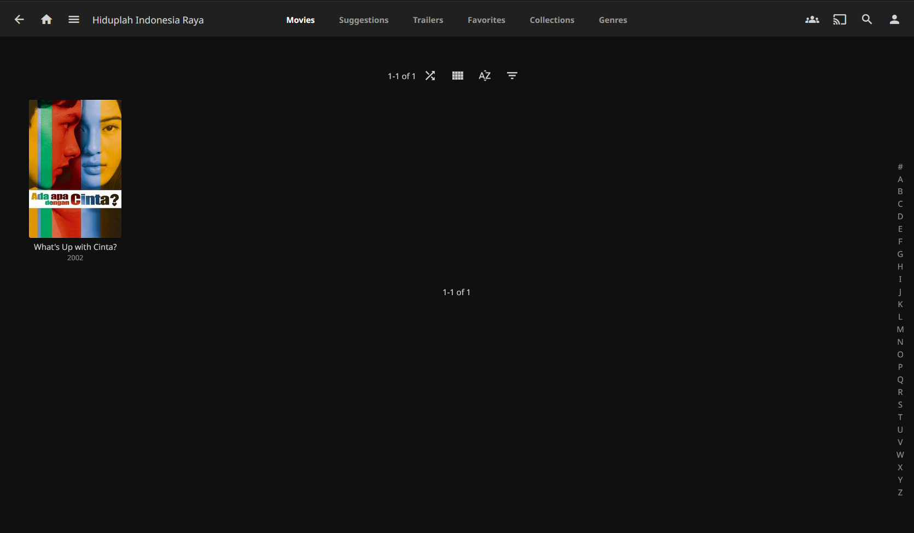

Saya bisa langsung nonton film-nya.

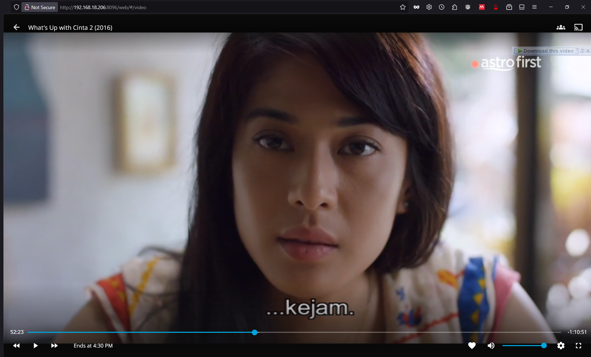

> Rangga, yang kamu lakukan ke saya itu..._jahat_.

## Penutup
Sekarang saya bisa nonton film tapi saya masih harus menambahkan film-nya via SFTP. Di masa depan saya ingin supaya ada automatisasi dan saya tidak perlu menunggu untuk mengunduh film baru. Hehehe, terima kasih sudah membaca. Ciao.