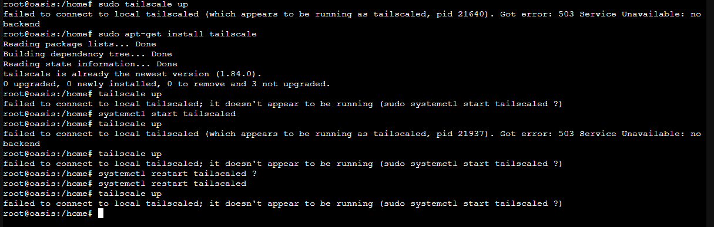
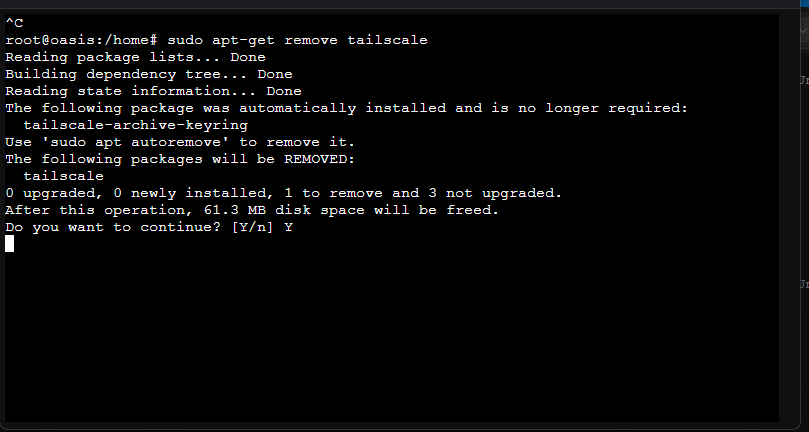
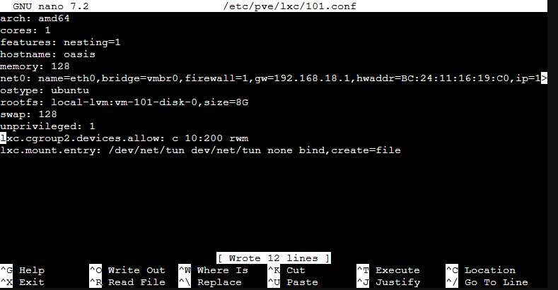
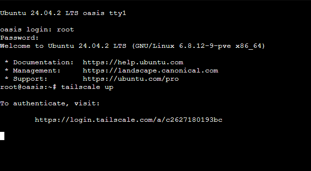
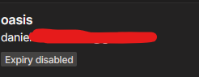
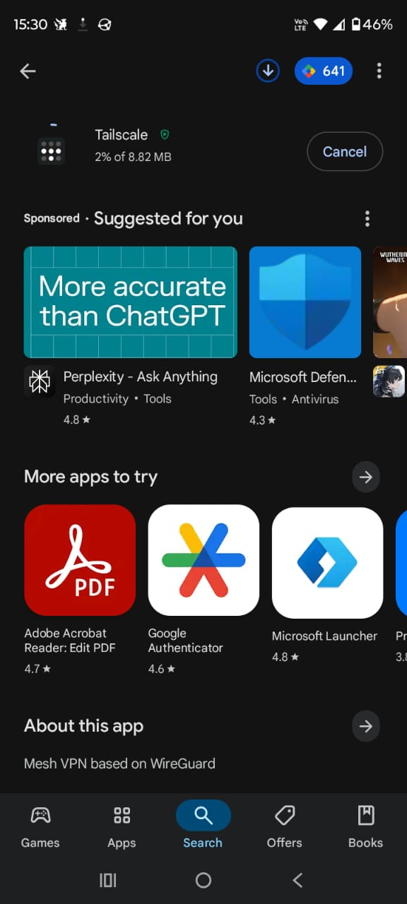
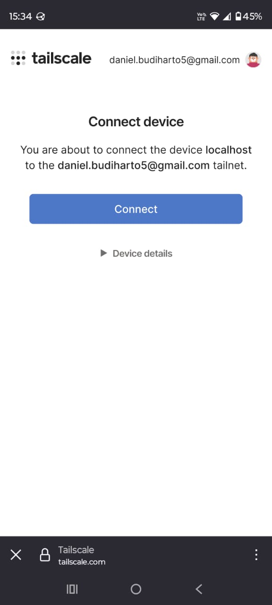
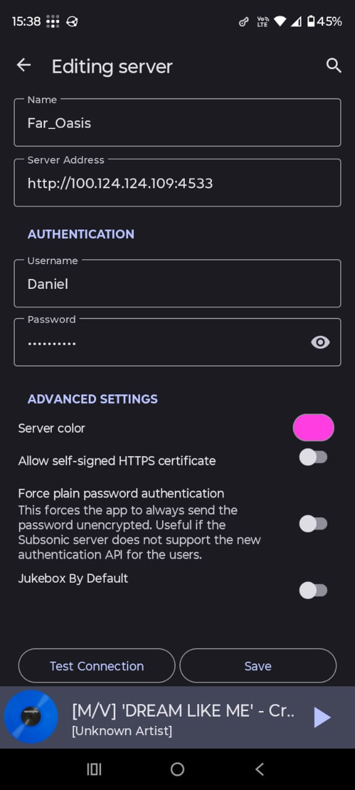
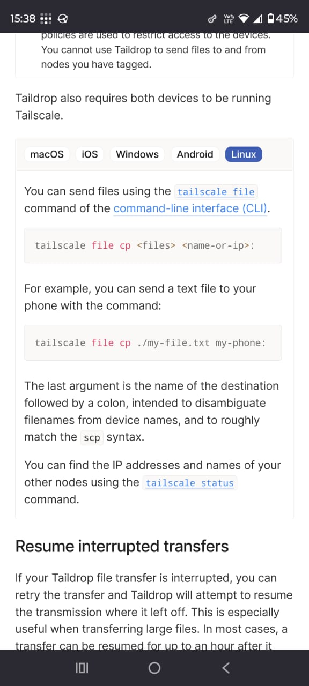
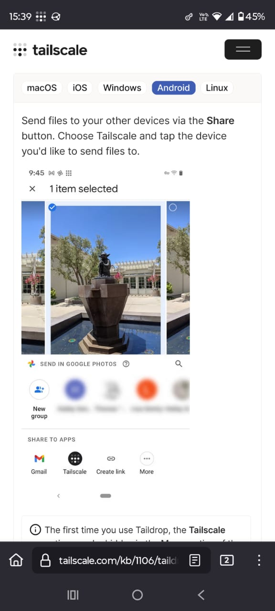

+++
date = '2025-06-26T13:48:50+07:00'
draft = false
title = 'Home Lab Revamp Part 4'
tags = ['indonesia', 'homelab']
+++
## Bagian Pengantar
Saya mau pergi ke Kota yang tidak pernah tidur sebentar lagi, tetapi saya masih mau streaming musik-musik yang ada di Oasis (server Navidrome). Saya tidak terlalu tertarik untuk menonton film jika sedang berlibur. Tapi, saya masih butuh musik untuk didengar tiap harinya. Oleh karena itu, saya akan melakukan konfigurasi Tailscale (sesuatu yang pernah saya lakukan sebelumnya) agar saya masih bisa mengakses Oasis meski di luar jaringan rumah.

## Konfigurasi

Saya ingatnya pakai Ubuntu 24.04 sebagai container Oasis, jadi saya hanya tinggal ikuti dokumentasi dari [sini](https://tailscale.com/kb/1476/install-ubuntu-2404)

Dan kita menemukan error

Ketika melakukan `tailscale up` saya diminta untuk start tailscaled, sudah saya lakukan tapi hasilnya masih sama saja. Saya akan mencoba untuk install ulang.

Dan waktu saya uninstall terminal terlihat nge-stuck jadi saya memutuskan untuk reboot

Saya menemukan bahwa ada konfigurasi lanjut dan dokumentasi yang sebelumnya saya sertakan hanya berlaku untuk VM, bukan untuk LXC container. Berikut ini adalah [dokumentasi lain](https://github.com/mossc001/Tailscale-LXC/blob/main/Guide) dan [yang lain lagi](https://tailscale.com/kb/1130/lxc-unprivileged) yang saya temukan

Saya perlu menyunting /etc/pve/lxc/{containerId}.conf

Saya memutuskan untukmengikuti yang versi official dari Tailscale dulu karena yang GitHub perlu konfigurasi (lagi). Jadi saya bakal reboot container-nya.

YESSS!

Saya tinggal copas url yang diberikan dan bisa login

Setelah login saya bisa melihat bahwa Oasis sudah ada di network tailscale

Saya matikan key expiry supaya saya tidak perlu bolak-balik login untuk container ini. Dan sekarang saya mau HP saya supaya masuk ke Tailnet (jaringan tailscale) juga

Setelah diminta untuk login, saya juga di-prompt untuk mengkoneksikan perangkat saya ke Tailnet

Setelah itu saya perlu konfigurasi untuk aplikasi client dari Navidrome. By the way, saya dulunya pakai substreamer tetapi kurang seamless. Sekarang saya beralih ke Ultrasonic.

Oh iya, saya mau share juga. Saya diminta untuk konfigurasi Taildrop. Setelah saya cari tahu ternyata kita bisa langsung kirim file antara perangkat yang ada di 1 Tailnet dengan Taildrop ini. Kerennnn

## Penutup

Sekarang saya tahu cara melakukan setting untuk tailscale di LXC container Proxmox dan mendengarkan musik menggunakan Navidrome dan Ultrasonic ketika jauh dari jaringan rumah saya. Saya juga dikenalkan tentang apa itu taildrop yang memungkinkan berbagi file antarperangkat di 1 tailnet. Hehehe, makasi sudah baca, ciao.