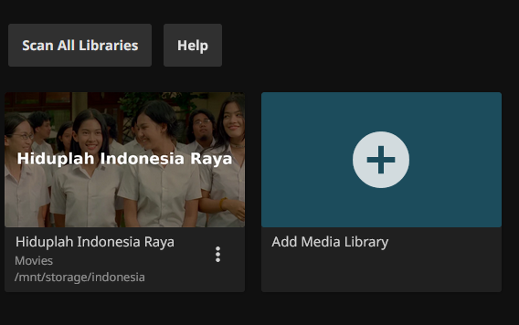

+++
date = '2025-06-27T11:20:23+07:00'
draft = false
title = 'Home Lab Revamp Part 5'
tags = ['indonesia', 'homelab']
+++
## Pengantar
Saya masih membutuhkan bantuan SFTP dan FileZilla untuk memindahkan film-film yang ada di harddisk PC ke harddisk dari Renner atau lebih tepatnya Aurelia (container untuk Jellyfin). Rencana awalnya saya ingin membuat skrip untuk mengautomatisasi pengunduhan film, jadi saya tinggal memasukkan URL sebagai argumen yang bisa langsung terunduh di Aurelia tanpa perlu membiarkan PC saya menyala untuk menunggu unduhan selesai. Namun, ternyata ada beberapa film yang unduhannya dijaga oleh CAPTCHA. Untuk itu saya masih perlu membuktikan bahwa saya adalah manusia (😬) sebelum mengunduh. 

Oleh karena itu untuk mempermudah pemindahan dan juga unduhan. Saya ingin mengatur Server Message Block atau SMB pada Aurelia. SMB memungkinkan adanya Drive baru yang bisa saya akses di section network pada File Explorer Windows, jadi sewaktu saya mengunduh, saya bisa langsung browse ke drive itu dan mengunduhnya langsung ke Aurelia. Saya tidak perlu mengunduh di PC dahulu, dan memindahkannya ke Aurelia via SFTP.

## Konfigurasi
Saya menemukan [tutorial](https://www.atlantic.net/vps-hosting/how-to-create-samba-share-on-ubuntu/) yang menunjukkan cara untuk konfigurasi dan saya ikuti.

Sewaktu saya ingin start service untuk smbd dan nmbd, saya mendapat error tetapi jika saya mengecek statusnya ternyata sudah running. Saya telan saja itu

Instead of following the tutorial editing smb.conf, saya memutuskan untuk memodifikasinya sedikit menjadi seperti ini

`
[Private]
comment = film share
path = /mnt/storage/
browseable = yes
guest ok = yes
writable = yes
valid users = @samba
`

Setelah itu saya membuat group baru bernama samba dan menambahkan jello ke group samba

Namun saat saya coba mengatur access list dari /mnt/storage saya mendapatkan permission denied, padahal sudah root.

Oke setelah menjalankan command di bawah ini

Saatnya saya coba hubungkan File Explorer ke Samba

Klik kanan di bagian Network lalu klik Map Network Drive, dan kita mendapatkan pop-up seperti ini

Yang perlu saya masukkan adalah abjad dari drive dan IP Address serta private dengan format sebagai berikut

`\\{ip-address}\private`

Lalu kita diminta memasukkan username dan juga password dari samba yang sudah kita atur dengan smbpasswd tadi

## Hasil

Saya bisa mengakses /mnt/storage yaitu harddisk yang saya beli kemarin via SMB. Bahkan file-nya bisa saya akses dengan baik

YESS!

Sekarang mari kita coba untuk pindahkan 1 folder

ke folder "Enggres"

Speed-nya bakal agak lama karena mengikuti speed dari jaringan rumah saya, which is fineee

OK, ini prosesnya sudah selesai dan memakan waktu sekitar 10 sampai 12 menit dengan kecepatan 5 MB/s

Sekarang karena ini ada di folder "Enggres" dan saya belum setup folder itu di Jellyfin, saya akan tunjukkan setupnya bagaimana

Di interface Jellyfin, kita pergi ke setting, klik libraries lalu klik pilihan dropdown pertama

Klik add media library

Masukan tipe konten dan namanya

*Ini yang paling penting*. Klik folder dan masukkan path yang betul. Untuk kasus ini adalah /mnt/storage/enggres

Dan akhirnya, Fight Club sudah dideteksi sama Jellyfin

## Kesimpulan
Saya sekarang bisa dengan mudah drag'n'drop dari File Explorer ke PC dengan SMB dan kalau saya mau download di PC saya bisa langsung browse ke SMP jadi tidak perlu pakai FileZilla untuk SFTP lagi. Thank you yang sudah baca, ciao.