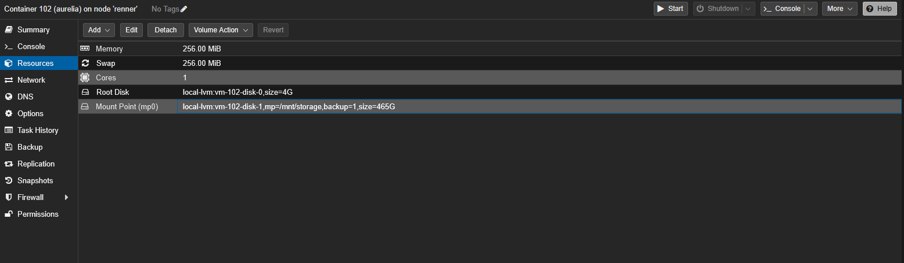
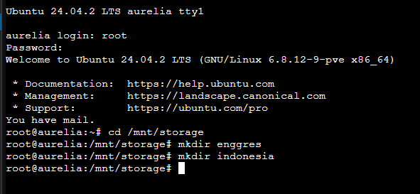

+++
date = '2025-06-30T16:17:06+07:00'
draft = false
title = 'Home Lab Revamp Part 6'
+++
## Pengantar
Ingat saat saya konfigurasi aurelia? Ternyata saya salah memilih lvm sehingga yang terpilih bukanlah vasopeso melainkan local-lvm untuk menyimpan film. Untuk menambah garam pada luka, saya juga sudah terlanjur konfigurasi samba pada local-lvm itu. Saya akan memperbaikinya di unggahan ini.

Sebenarnya di belakang layar, saya sudah utak-atik dan saya membuat kesalahan lainnya😬. Sejujurnya untuk vasopeso sudah ditambahkan sebagai mount point

Tetapi di tengah jalan saya berubah pikiran untuk mengalokasikan 125 GB saja daripada 500 GB. Saat saya coba remove ternyata mendapat error di atas. Dan ketika saya coba detach di hardware pane

OK, rasanya saya perlu shutdown sebentar. Dan setelah shutdown, menu remove muncul dan saya bisa menghapus vasopeso tadi

## Konfigurasi

Saya hapus dulu semua disk kecuali root dan saya buat mount point baru

Lalu saya buat 2 folder di /mnt/storage

Kemudian saya ubah permission dari folder /mnt/storage

Kemudian saya tinggal copy-paste film-film dari PC ke Aurelia via Samba

## Kesimpulan

Waktu konfigurasi GUI sebaiknya diperhatikan baik-baik. Sekarang local-lvm saya bisa menjadi lebih lega dan dapat diinstal lebih banyak CT atau VM. Selain itu, harddisk saya sekarang dapat digunakan dengan baik. Ciao.