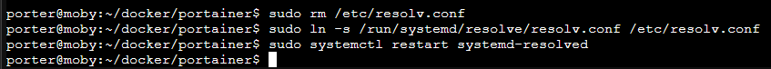
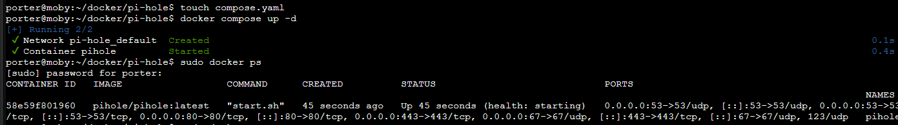

+++
date = '2025-07-03T13:48:45+07:00'
draft = false
title = 'Home Lab Revamp Part 7'
tags = ['indonesia', 'homelab']
+++
## Pengantar
Seperti yang kalian sudah tahu, saya biasanya membuat Linux Container untuk deploy _satu_ aplikasi yang saya butuhkan. Semisal, untuk Navidrome saya deploy 1 container, untuk Jellyfin juga saya deploy 1 container, untuk syncthing juga saya deploye 1 container. Saya takut nanti akan terjadi hal yang bernama _container sprawl_. Apa itu _container sprawl_? Sebenarnya itu terminologi yang saya buat-buat berdasarkan _VM sprawl_ sih, _VM sprawl_ sendiri adalah [kondisi di mana banyak sekali VM yang tidak terkontrol di suatu lingkungan virtual](https://www.ibm.com/think/topics/vm-sprawl). Di kasusku bukannya VM melainkan CT, saya harap kalian mengerti maksudku. Sekarang saya berpikir untuk membuat 1 CT lagi (semoga saja jadi yang terakhir) dan _from now on_ memasang segala aplikasi yang mau saya pasang di CT itu. Supaya menghindari konfigurasi yang berlebihan dan saling tabrak, saya akan menggunakan teknologi yang bernama Docker dan juga Portainer untuk memudahkan konfigurasi. Aplikasi pertama yang saya ingin install adalah PiHole, DNS service untuk memblokir iklan-iklan di traffic. Saya sendiri sudah menggunakan uBlock Origin sebagai adblocker tetapi saya rasa lebih baik untuk memblokir iklan bahkan sebelum diterima oleh browser dan komputer saya.

## _Peringatan_

Saya gagal.

## Deployment Container
Pertama, saya perlu mengakses Proxmox Web UI

Untuk template dari LXC saya akan pakai Ubuntu (cuma itu yang saya punya, wkwkwk).

Dan setelah menunggu task Proxmox, saya sudah bisa login sebagai root di moby (nama CT yang baru).

## Buat User Baru di CT
Seringkali saya menggunakan root user untuk menjalankan service. Hal ini terjadi pada Container saya yang saya gunakan untuk menjalankan Navidrome dan Syncthing. Pada Jellyfin, saya akhirnya memutuskan untuk membuat user sendiri. Hal yang sama juga akan saya lakukan pada CT moby ini.

## Instalasi Docker dan Portainer

Pertama, saya ingin membuat folder baru untuk menyimpan file-file dari Portainer

Setelah itu saya ingin menjalankan `apt update` dan `apt upgrade`.

Setelah update dan upgrade selesai, saya perlu mengikuti step-by-step instalasi dari [website dokumentasi instalasi Docker di Ubuntu](https://docs.docker.com/engine/install/ubuntu/)

OK, sudah terinstall.

Sejujurnya, saya terinspirasi dari [video ini](https://youtu.be/fWDqCNcvUPs?si=uT-TS79O-KplCi9C&t=512) untuk menggunakan Portainer. Saya coba untuk mengikuti langkah-langkahnya dengan menggunakan docker-compose.yml

`nano docker-compose.yml`

Paste dari [sini](https://github.com/xholicka/portainer-templates/blob/main/portainer/docker-compose.yml)

Lalu jalankan `docker compose up -d`

Fingers crossed...

OK, saatnya coba akses via website dari komputerku.

Heck yeah!

## Instalasi PiHole sebagai DNS

Pertama saya perlu klik connect di environment local

Setelah itu klik "Stack"

Lalu "Add Stack", dan kita akan ditunjukkan halaman seperti ini

Kita ambil docker-compose.yml dari [sini](https://github.com/pi-hole/docker-pi-hole/#running-pi-hole-docker)

Dan ubah beberapa hal (seperti TZ dan password) menjadi seperti ini

Dan setelah itu kita klik "Deploy the Stack"

Dan kita mendapatkan error

Berarti port itu masih ada yang pakai dan saatnya mengecek dengan [`ss -tuplen`](https://serverfault.com/questions/309052/check-if-port-is-open-or-closed-on-a-linux-server)

OK, berarti uid process-nya itu 992 untuk TCP/UDP 53

Dan setelah membaca lebih lanjut dari [sini](https://github.com/pi-hole/docker-pi-hole#installing-on-ubuntu), ternyata ada konfigurasi khusus untuk Ubuntu. Untungnya, saya menemukan [tutorial ini](https://pimylifeup.com/pi-hole-docker/). Saya perlu mengubah konfigurasi dengan `sudo nano /etc/systemd/resolved.conf`. Saya perlu mengubah `#DNSStubListener=yes` menjadi `DNSStubListener=no`. Setelah itu menjalankan command seperti berikut

Lalu kita coba create stack di portainer lagi...

YES!

Eits, jangan terlalu cepat senang dulu, kita masih perlu menunggu...statusnya masih starting tuh. Dan ternyata masih gagal, statusnya unhealthy dan ada error seperti ini

Dan setelah mencoba mencari-cari...saya menyerah deh...saya coba ikutin pakai docker dengan CLI dari [sini](https://pimylifeup.com/pi-hole-docker/) aja

Masih starting...

**SAUS TARTAR!** Unhealthy lagi...At this rate, saya akan coba install LXC yang bukan Ubuntu deh.

Saya pada akhirnya memutuskan untuk pakai Debian

OK, download-nya sudah selesai, kecil juga.

Setelah buat CT, buat user baru, saya dapet ini.

OK, berarti saya perlu jadi root lagi abis itu install sudo, habis itu jangan lupa tambahin user baru ke sudoers.

Dan bisa jalan.

Setelah selesai install docker, saya buat direktori di home.

Setelah buat `docker-compose.yaml` kita jalankan container-nya

**RAJUNGAN!** Kena lagi deh

OK, kita tunggu lagi deh...fingers crossed

hadeh.

## Kesimpulan

Saya sudah berhasil install portainer tapi gagal install pi-hole di docker-nya. Mungkin saya akan pakai cara trandisional untuk pi-hole dan menggunakan portainer untuk service yang lain. Thank you udah baca...sorry kalau tidak sesuai ekspektasi. Ciao.