+++
date = '2025-07-12T13:55:01+07:00'
draft = false
title = 'Home Lab Revamp Part 8'
tags = ['english', 'homelab']
+++
## Preface
Before my home lab came to a new leaf, it used to run an RSS Feed Aggregator. What is that? Well, RSS stands for Really Simple Syndication, it simplifies the process of viewing news. Normally, people visit website A (international), B (local), C (tech) to read news that matches their interest. However it can be grueling if you would like to visit 5, or even thousands of sites. Therefore, a _good and helpful_ website would create an RSS Feed, an URL that you can put into an RSS Aggregator and the aggregator itself would compile all the updates new from various sites. 

This [website](https://www.nps.gov/feeds/rss-help.htm) explains it so well.

Now I want to deploy a different aggregator. Previously, I used FreshRSS but I would like to have a change of pace and try Miniflux.

## Re:do

Actually I purged Moby...a CT that runs Portainer because of my perfectionism😬. Let me walk you through to relaunch of Moby

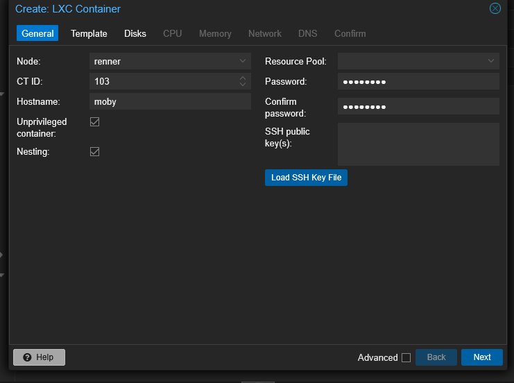

I select Debian as the CT template this time.

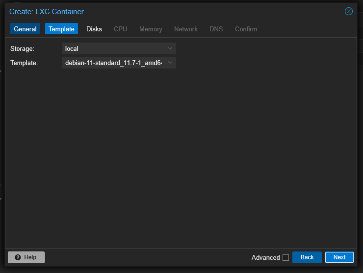

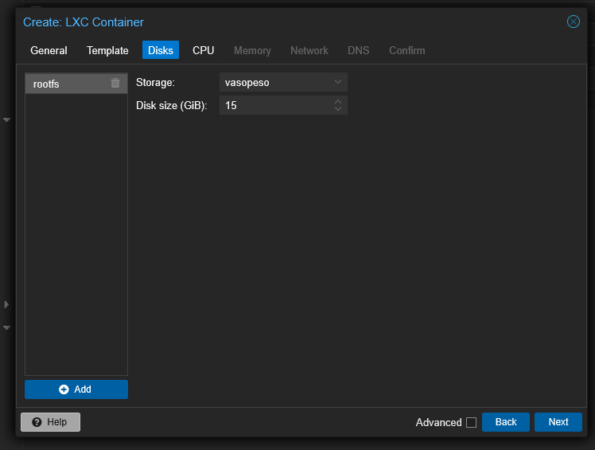

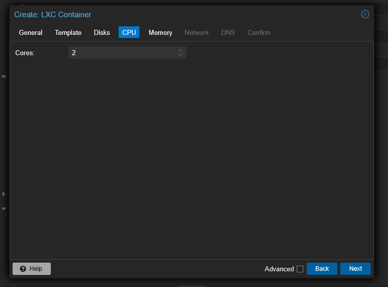

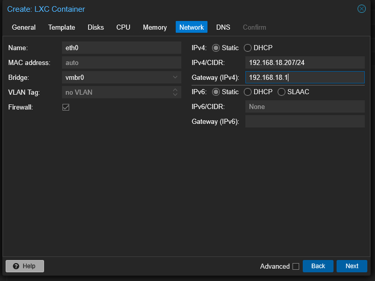

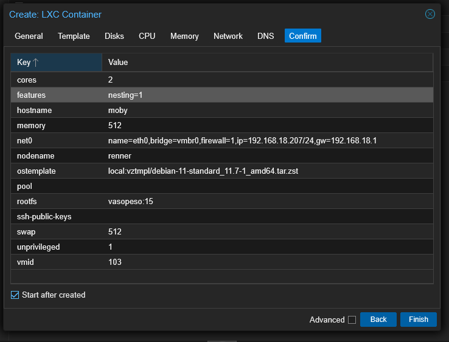

And immediately after the CT is up and running, I update and upgrade the packages. That's done and I created a new user

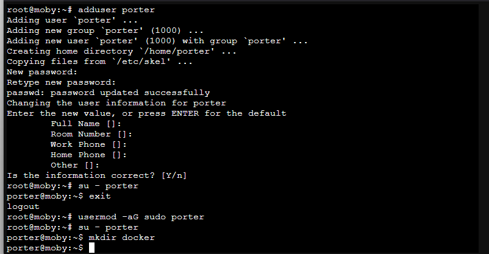

I followed the docs for [Debian installation](https://docs.docker.com/engine/install/debian/)

And after Docker is installed I created `docker-compose.yml` and put this configuration https://github.com/xholicka/portainer-templates/blob/main/portainer/docker-compose.yml. I just removed the line that says version 3.

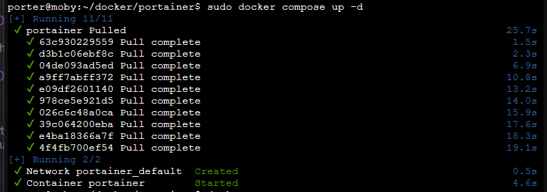

## Miniflux

I just copy the docker-compose from [this site](https://miniflux.app/docs/docker.html#docker-compose) changed the port number, users, and passwords. Just like this iamge

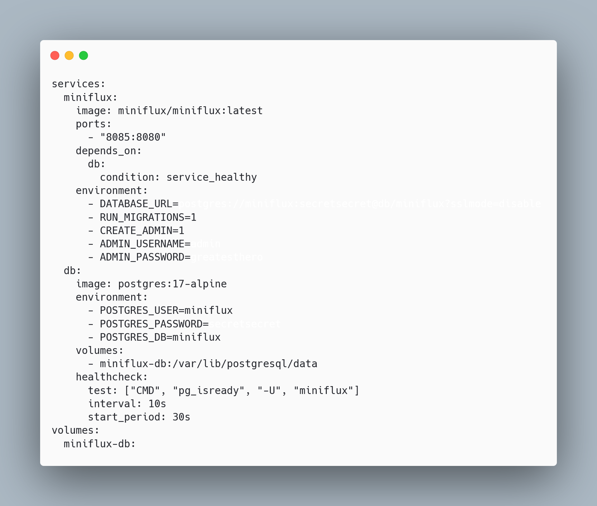

And after I deployed it using Portainer

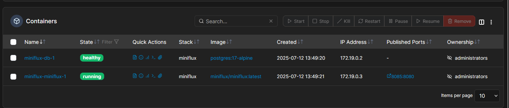

It is now running

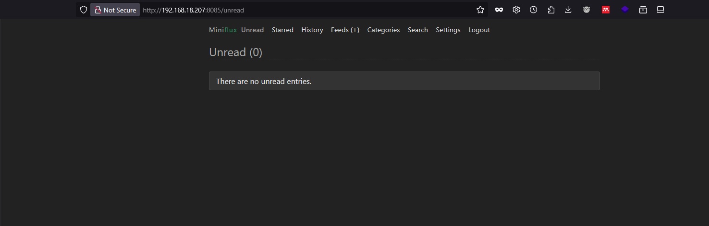

And it's now accessible

## Conclusion

I successfully deployed Portainer AND Miniflux, now I can surf and follow the news in the internet without getting overwhelmed by weird algorithms and contents.