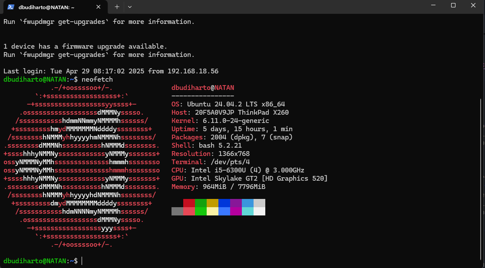

+++
date = '2025-06-18T00:17:11+07:00'
draft = false
title = 'Home Lab Revamp'
tags = ['indonesia', 'homelab']
+++
## Dibuat di Surga
Aku memutuskan untuk merombak _setup_ home-lab ku. Kenapa? Karena ada banyak conflict antara service yang berjalan. Aku mencoba memasang Pi-Hole untuk eksperimen DNS dan _Ad-Blocker_ tapi ternyata itu conflict dengan Apache Web Server. Aku tidak mau mematikan Apache karena FreshRSS, Nextcloud berjalan di atas itu. 

Alasan yang kedua adalah aku ingin melakukan ekspansi untuk _storage_. Thinkpad X260 serverku sekarang memiliki "hanya" 128 GB. Aku berencana untuk membuat SMB dan memindahkan banyak film dari PC-ku (sekitar 87.7 GB, 56 film) untuk ditonton dengan streaming via Jellyfin. _Kenapa engga streaming pakai website biasa aja?_ Jawabannya karena ada risiko bakal patah-patah. Aku juga berencana melakukan banyak hal seperti mendownload otomatis film via _torrent_ ke serverku jadi aku tidak perlu menyalakan PC-ku dan menunggu proses _download_ selesai. 

_Post_ ini adalah bentuk dari dokumentasi dalam proses perombakan ini.

## X260
Mari kenalan dulu sama _lappy_ yang bakal kuoprek. Dia akan kuberi nama, "RENNER" yang artinya pelari (dari bahasa Jerman) dan nama itu bersifat palindrom (dibaca dibalik tetap RENNER). Dia adalah Thinkpad X260 yang kubeli 27 Desember 2021. Waktu itu aku ada di kampung halaman, cuma punya PC dan PC-ku ada di kota aku kuliah😢. Karena mati bosan aku memutuskan untuk membeli laptop yang "murah". Berikut penampakan si doi.

### Sejarah X260
Sedikit _flashback_, Aku kurang puas dengan _layout_ _keyboard_ Jepang-nya. Jadi aku beli lagi keyboard khusus untuk _layout_ US, tapi karena aku terlalu tengil jadi keycap untuk _backspace_ jadi lepas dan aku engga tahu cara benerinnya.

Setelah beberapa bulan beli, aku kembali kuliah dan laptop ini jadi tidak terpakai. Aku memutuskan untuk meminjamkannya ke sahabatku. Setelah dipakai beberapa semester, laptopnya rusak...keyboard-nya ngetik sendiri sama ada beberapa _keys_ yang tidak berfungsi. Sudah tertekan tetapi dia tidak mau merespon. Sahabatku beli laptop baru dan kembaliin si RENNER.

Aku kira aku masih bisa pakai RENNER sebagai laptop (bisa dibawa ke warkop). Tapi setelah aku coba ganti _keyboard_ ke Jepang lagi ternyata masalahnya di konektor😫. Bisa sih pakai _keyboard_ eksternal tapi yang aku ga suka itu _ghost click_ nya, tiba-tiba bisa ngespam YYYYYYYYYYYYYYYYYYYYYYYYYY tiada aliran elektron tiada tekanan jari manusia.

### Kondisi

I/O keyboard ini cukup lengkap, di bagian kanan ada

- _Audio combo jack_
- _USB A 3.0_ (support _Always on_)
- _SD Card Reader_
- _Port RJ45_
- _Kensington Lock_
- _Slot SIM card_ (aku cukup takjub dengan adanya ini, soalnya ini cuma ada di laptop kelas bisnis)

Di bagian kiri ada

- _DC jack_
- _HDMI port_
- _Mini Display Port_
- 2 _USB A 3.0_

Namun sayangnya ada sedikit masalah di skrup bagian kanannya. Skrupnya tidak mampu melekatkan bodi atas dan bawah sehingga ada sedikit celah seperti ini

RENNER masih bisa nyala dan bisa kugunakan sebagai bahan _homelab_, aku bersyukur untuk itu.

Ini adalah spesifikasi hardware singkat dari RENNER

Sedikit tambahan kalau RENNER sebenarnya punya slot M.2 SATA tapi engga kepake dan untuk _booting_ dia pakai SSD SATA 2.5 _inch_ 128 GB.

## Memilih OS

Sebelumnya, aku menggunakan Lubuntu 24 untuk OS _homelab_ ku. Saat itu aku belum tahu tentang Proxmox. Sebuah OS yang memungkinkan virtualisasi VM dan Container. Dengan Proxmox aku tidak perlu takut dengan terjadinya _conflict_ seperti yang aku ceritakan sebelumnya. Aku kenal Proxmox dari [video ini](https://youtu.be/cMVcclMkp7g?si=o5Eu6_09dNmtT5gg&t=443). Saatnya kita mulai instalasi

1. Aku kunjungi situs resminya dan memilih Proxmox VE (_Virtual Environment_) untuk di-download. Pada waktu aku menulis ini, aku sedang menunggu prosesnya selesai.
2. Ambil _flashdisk_ engga kepake trus buat jadi _bootable_ USB dengan ISO yang baru di-download. Di sini aku pakai Rufus

Aku kaget karena aku dapet _warning_ kalau bakal pakai DD image (aku engga tahu apa itu, dan rasanya sejauh ini aku buat _Bootable_ USB) engga pernah pakai itu

Setelah kucari ternyata [ini bedanya](https://github.com/pbatard/rufus/issues/843)
Oke...dan pas aku klik ternyata aku engga bisa akses USB-nya dan USB-nya jadi 2 partisi

Dan aku juga engga bisa akses F: dan G: (kedua partisi USB itu)

Jawabannya juga ada [di sini](https://github.com/pbatard/rufus/issues/843)
> But this can also be one of the drawbacks, as it means you will usually find that you cannot access the content of your USB any longer after it has been created.
Itu menjelaskan kenapa.
3. Sekarang aku perlu colok aja USB ini ke RENNER dan install Proxmox-nya. Aku udah lihat [video tutorial ini](https://www.youtube.com/watch?v=_u8qTN3cCnQ) dan kelihatannya tidak begitu buruk.

## Proxmox Setup
Jadi langsung saja aku masuk ke _boot option_ dan memilih _flashdisk_ untuk di-_boot_

Lalu aku disuguhkan Welcome Screen yang langsung kupilih _graphical installation_

Seperti instalasi _software_ lainnya aku juga disuguhkan EULA

Setelah itu aku diminta untuk memilih _harddisk_ instalasi dan aku melihat tombol _options_

Oke di menu ini ada beberapa size yang bisa kita tentukan, penjelasan dari hdsize, minroot, swapsize, minfree, dan maxvz dapat ditemukan [di sini](https://www.reddit.com/r/Proxmox/comments/1bpfiaj/question_about_disk_sizes/)

Kurang lebih artinya begini
- hdsize: ukuran dari harddisk yang ingin digunakan untuk **semua** partisi
- swapsize: kapasitas memori swap (_virtual memory_) untuk partisi ini
- minroot: ukuran dari partisi OS
- minfree: ukuran dari harddisk yang tidak boleh digunakan
- maxvz: ukuran untuk disk VM, dan kawan-kawan

Aku biarkan kosong saja

Lalu aku ditunjukkan halaman untuk konfigurasi jaringan

Aku coba cari-cari tentang apa itu _hostname_, ternyata [bisa aku awur](https://forum.proxmox.com/threads/hostname-fqdn-huh.63667/), yang penting masuk saja. Berikut adalah konfigurasiku

Akhirnya aku ditunjukkan ringkasan tentang Proxmox yang kubuat dan ini hasilnya

Dan setelah reboot, aku bisa login. Dan _seharusnya_ aku bisa akses Proxmox dari IP address port 8006

Dan saat kucoba akses 192.168.18.78:8006, lihat apa yang terjadi

Saat aku coba `ping` juga tidak dapat sampai

Lalu aku sadar...aku belum menghubungkannya ke Wi-Fi, bruh. Setelah aku mencari-cari aku menemukan [situs ini](https://www.x88.in/proxmox-with-wifi) dan aku langsung edit `/etc/network/interfaces` dengan menambahkan `wpa-essid` dan `wpa-psk` menjadi seperti ini

Dan setelah aku reboot dan aku coba ping 1.1.1.1 ternyata masih tidak bisa. Aku coba ping PC-ku juga tidak bisa😔. Setelah sekian lama mencari ternyata menggunakan Wi-Fi tidak disarankan

> Avoid using WLAN if possible, it has several technical limitations making it not really suitable as single interface of a hyper-visor like PVE. 

Oke...aku memutuskan untuk berhenti di sini karena aku tidak punya kabel LAN.

## Proxmox Setup Retry

Akhirnya, ini kabel LAN yang kupesan sudah sampai. Setelah aku test menggunakan laptop-ku (yang bukan untuk server) ternyata bisa tersambung ke internet. Setelah itu aku memutuskan untuk menyambungkannya ke RENNER namun masih tidak bisa mencapai 1.1.1.1. Aku pun memutuskan untuk meng-install ulang Proxmox (hal ini bisa dihindari jika aku lebih rajin😬). Setelah itu aku mendapat kabar baik.

Dan juga...aku bisa mengakses :8006 untuk mengakses Proxmox via web UI dari PC-ku. 

Biar lebih aman aku _reserve_ juga _static_ IP di pengaturan modem Wi-Fi-ku

### Mencegah _Suspend_ saat _Lid_ Ditutup
Saat ditutup, laptop biasanya akan masuk ke _mode_ _sleep_/_suspend_. Aku ingin supaya RENNER tidak masuk _mode_ itu ketika aku menutupnya. Oleh karena itu aku mengubah konfigurasi di `/etc/systemd/logind.conf`. 

Aku mengubah line yang kelihatan seperti ini

`#HandleLidSwitch=suspend`

dan ini

`#HandleLidSwitchDocked=ignore`

menjadi

`HandleLidSwitch=ignore`

dan

`HandleLidSwitchDocked=ignore`

Perhatikan **tanda pagarnya**. Hasilnya bakal seperti ini

Setelah itu aku perlu _save_ _file_-nya dan juga restart systemd

`systemctl restart systemd-logind.service`

Setelah kucoba...it works🥳. Oh ya aku ketemu tutorialnya [di sini](https://youtu.be/_u8qTN3cCnQ?si=4I_h-ul_g7U5Y2gk&t=1588)

### Mematikan layar
Aku tidak mau jika layarku menyala 24/7 karena akan membuat RENNER jadi kepanasan. Jadi aku coba mencari cara mematikan layarnya. Ternyata di [video yang sama](https://youtu.be/_u8qTN3cCnQ?si=jGAl1fB45Z94MhQt&t=1705) juga dijelaskan. Aku perlu mengedit file dengan

`nano /etc/default/grub`

lalu ubah line ini

`GRUB_CMDLINE_LINUX=""`

jadi

`GRUB_CMDLINE_LINUX="consoleblank=60"`

Angka di situ menunjukkan berapa detik layar akan mati setelah tidak ada aktivitas. Enam puluh berarti layarku akan mati setelah 60 detik (1 menit tanpa aktivitas). Setelah itu, untuk mengimplementasikan perubahan, aku jalankan

`update-grub`

### Koneksi Harddisk
Aku punya _harddisk_ 1 TB yang rencananya akan kugunakan untuk NAS dan juga menyimpan film serta musik. Pada saat kuhubungkan pertama kali, Proxmox belum mendeteksi adanya _harddisk_ itu. Tetapi setelah aku melakukan _reboot_ harddisk itu dikenali sebagai `/dev/sdb`

Aku menemukan jawaban dari [Reddit](https://www.reddit.com/r/Proxmox/comments/miq0f5/erase_and_format_used_hdd_in_proxmox/) tentang cara untuk memformat _harddisk_-ku.

`fdisk -l` dulu untuk melihat disk-nya. Ternyata _harddisk_-ku ada di `/dev/sdb`. Trus aku jalanin

`fdisk /dev/sdb`, habis itu pas CLI-nya berubah aku ketik `d`, `Enter`, habis itu `w`, `Enter`. Pas aku klik `d` lalu `Enter`, itu bakal menghapus partisi di _harddisk_-ku. Pas aku ketik `w` itu berarti bakal _write changes_ ke _harddisk_-ku Kebetulan cuma ada 1 jadi aku perlu jalanin sekali. Habis itu aku ngelihat disk-nya lagi, betul deh, partisinya hilang. Sekarang saatnya buat partisi baru.

`fdisk /dev/sdb`
`g`, ini bakal ngebuat partisi baru
`w`

Oke sampai sini. Aku baru sadar ternyata ada GUI-nya...

_Moving on_, aku mau buat jadi beberapa partisi yaitu
- 300GB untuk film-film
- ...dan sisanya aku belum tahu😬

Kita masih bakal pakai `fdisk` karena aku ketemu [website buat tutorialnya](https://phoenixnap.com/kb/linux-create-partition).

Masalahnya pas aku langsung masukkin `n` aku dapet prompt ini

Aku gak tahu bedanya _primary_ sama _extended_, jadi aku perlu [Googling](https://www.eassos.com/blog/partition-types-primary-extended-and-logical-partitions/) lagi. Untung langsung nemu dan sat-set sat-set, aku langsung pilih _primary_, _start_ 2048, _last sector_ +300GB, abis itu langsung `w`. DONE.

### Syncthing
Setup Syncthing jadi prioritasku biar aku bisa sinkronkan PKMS (_Personal Knowledge Management System_)-ku antara PC, _laptop_, dan ponsel. Aku kepikirannya pakai _container_ aja soalnya aku cuma jalanin 1 aplikasi dulu. Aku perlu cari cara buat _container_ di Proxmox. Aku ketemu [video ini](https://www.youtube.com/watch?v=ufiSO9RHhYg) yang pake Docker. 

1. Aku perlu _download template_ untuk _container_-nya, aku pilih Ubuntu karena...aku lebih suka aja. Sekarang kita menunggu lagi.

DONE

2. Sekarang aku perlu klik Create CT

Buat _disk_ aku pilih SSD aja karena PKMS harusnya engga ngabisin banyak tempat. Aku alokasiin 8 GB biar lega (kelegaan malah).

Aku set 1 _core_ aja buat CPU

Ini konfigurasi buat _network_-nya dan aku biarin aja sih

Dan di akhir, aku dikasi _summary_ dari CT yang mau aku buat.

3. Setelah itu aku perlu install Docker di CT yang baru kubuat, aku baru aja berhasil login

Abis itu di tutorial-nya nyaranin buat _update_ dan _upgrade_. Buat kalian yang belum tahu, _update_ itu bakal _download_ informasi dari _update_-annya (versi berapa yang baru) dan _upgrade_ itu baru yang bakal mengaplikasikan _update_ yang rilis itu

`apt-get update && apt-get upgrade`. Engga perlu `sudo` di depan karena kita udah root. 

Habis itu kita _install_ `curl`, `apt install curl -y`. Dan setelah _tinkering_ beberapa saat kita dapat masalah

KAGAK BISA CONNECT INTERNET!!!

Aku coba edit dengan nambahin IP _address_

Mantap betul👍

Kalau kata temenku ini namanya FAFO, which stands for F*ck Around and Figure Out. 

Sekarang kita back to the previous step, get update, upgrade, dan sekarang kita tambahin `--fix-missing`.

DONE

trus kita _run command_ ini

`curl -sSL https://get.docker.com | sh`

Aku engga ngerti apa artinya `flag` -sSL...aku coba cari di [Explain Shell](explainshell.com) dan [ini jawabannya](https://explainshell.com/explain?cmd=curl+-sSL+https%3A%2F%2Fget.docker.com)

Dan setelah menunggu (lagi). Docker sudah terpasang

4. Instal Syncthing di Docker-nya. Ini sebenernya udah malem pas aku nulis ini dan sekarang aku gmw ribet😫😫😫, jadi langsung aja aku _run_ ini

`docker run -d \
  --name=syncthing \
  --hostname=sinker `#optional` \
  -e PUID=1000 \
  -e PGID=1000 \
  -e TZ=Etc/UTC \
  -p 8384:8384 \
  -p 22000:22000/tcp \
  -p 22000:22000/udp \
  -p 21027:21027/udp \
  -v /path/to/syncthing/config:/config \
  -v /path/to/data1:/data1 \
  -v /path/to/data2:/data2 \
  --restart unless-stopped \
  lscr.io/linuxserver/syncthing:latest
`

Okeh maknyus, sudah jalan. Sekarang aku mau coba SSH, tapi ternyata kena tolak terus padahal sshd jalan, password dah betul juga. Ternyata aku [perlu edit](https://forum.proxmox.com/threads/cannot-ssh-to-new-container.38114/) `/etc/ssh/sshd_config` trus ubah `#PermitRootLogin prohibit-password` jadi `PermitRootLogin yes` dan voila!

Sekarang aku bisa melakukan SSH Tunneling

`ssh -L 6065:localhost:8384 root@192.168.18.204`

dan...

Keren bat guwa mah😎

sekarang saatnya buat folder baru, trus tinggal hubungin deh via GUI. 

5. Setting folder dan GUI

Oke kalau soal GUI tinggal teken-teken aja lah ya, sekarang aku dapet masalah yang menarik.

Aku udah buat folder dengan path dan permission seperti ini

Tapi masalahnya, aku dapet error message ini terus

Setelah 2 kali mencoba aku sadar, "Iya juga ya, kan syncthing-nya jalan di Docker". Kurang pintar saya memang, namanya juga belajar.✌️✌️✌️🕊️🕊️🕊️

Daripada kesulitan mending aku langsung install Syncthing-nya di Ubuntu, kagak usah pake acara Docker-Dockeran segala.

Stop dulu deh Docker-nya

Abis itu install syncthing versi normal

6. Aku tinggal ikutin [dokumentasi dari APT](https://apt.syncthing.net/) buat install syncthing.

Mantap, udah terinstall. Sekarang saatnya ngetes.

OK, GUI sudah bisa diakses via SSH Tunnelling. Sekarang saatnya klik-klik lagi. Eits tapi sebelum itu aku mau install tmux supaya Syncthing bisa jalan di-"background" (sort of). Aku pakai apt-get install dan aku ikutin aja [tutorial dari sini](https://www.linuxtrainingacademy.com/tmux-tutorial/)

Dan taraaa

Kurang lebih ini gambaran buat sinkronisasi file-nya

RENNER aku jadiin episentrum untuk menyimpan file yang baru. Semisal aku edit di HP dan PC-ku mati, file-nya bakal ke-save di RENNER, dan aku bisa fetch dari PC-ku ketika kunyalakan. Begitu juga sebaliknya.

Fyuh panjang juga ya postingan ini. Thank you yang udah baca sampai abis dan nyimak aku nge-FAFO. Aku rencananya bakal maintain dan ngasi tahu kalau ada update dari homelab-ku ini. Hehe, ciao.