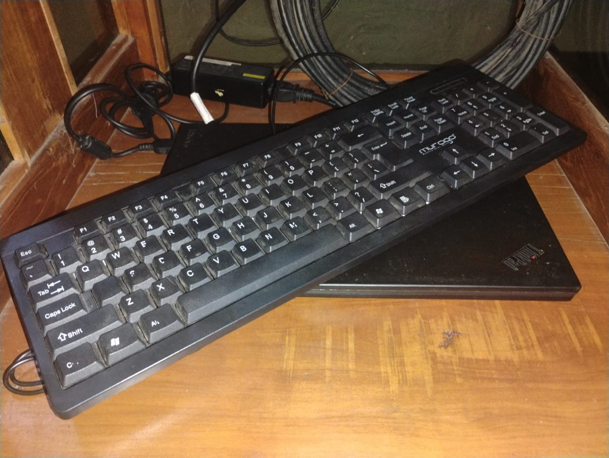
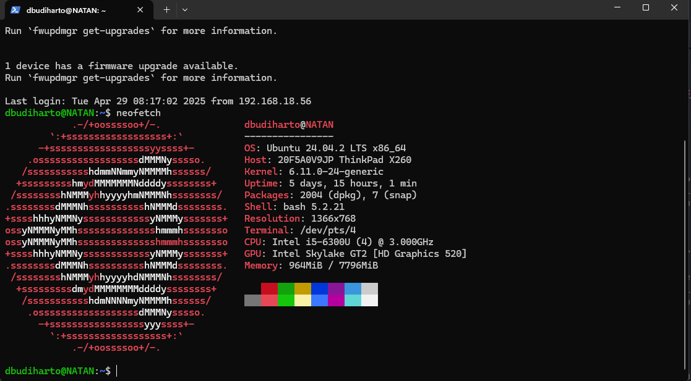
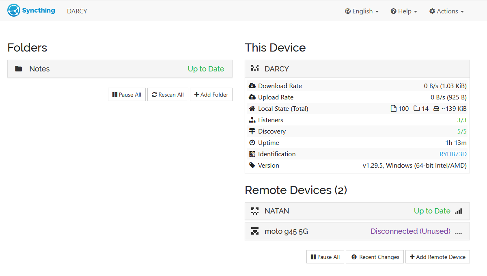

+++
date = '2025-05-03T11:42:00+07:00'
draft = false
title = 'Home Lab'
tags = ['english', 'it']
+++
## Background

I had a friend whom I lent my old laptop to. It was a Thinkpad X260 that I bought 4-5 years ago. He gave it back to me because of some issues: keyboard is typing on its own, and it is not responsive. In the first place, soon after I got the laptop first hand 4 years ago, I replaced the keyboard. Its layout was Japanese and I felt uneasy typing with Japanese keyboard. So, I put the old keyboard sparepart in a box, used the laptop for a while, even broke the *backspace* key, and lent it to my friend. As soon as he returned the laptop, I checked and confirmed the issue. I wanted to tinker in Linux and that kind of stuff so I thought that using that old laptop would be a good idea. I replaced the keyboard to the old Japanese keyboard, and unfortunately the issue remained. "It must be the connector", I thought. Even though I had a full-size membrane keyboard laying around, I still didn't think using a **portable** laptop with a **full-size** keyboard is a good idea, it would occupy much space. 

## Intermezzo

I stumbled upon NetworkChuck video, [the hacker's roadmap 2025](https://www.youtube.com/watch?v=5xWnmUEi1Qw). Well as you may notice, I feel like I'm a misfit in software development and I decided to try Cyber Security field. In all the stages, 1 until 4, Chuck repeatedly emphasized to build a home-lab. If you're not familiar about it, a *Home-Lab* is is a personal laboratory at home where you can conduct an experiment in IT. Something like deploying self-hosted software, build a firewall/adblocker, and many other things. 

## Ray of Sunshine

I finally decided to create a simple homelab, using that keyboard-broken Thinkpad X260. I flashed Lubuntu on it, because it is light-weight, and I still need a GUI (shame on me). It keeps running 24/7 for about 1 month now. There are applications that I installed which are Syncthing, FreshRSS, Nextcloud, Navidrome, and I even created a RSS Feed Generator using Python and Serp API (still proud about it till today).

## Syncthing

To put it simply, Syncthing is a tool to synchronize files across devices in a network. I use it to keep my Personal Knowledge Management System, or just my notes synced so I can edit it on my working desk, on my laptop, or even my phone. *But Daniel, you can surely use Google Drive or OneDrive right?* Of course! Who do you think I am? But that's the main point of it. Self-hosting liberates me from the big companies farming my data. **I OWN MY DATA AND I AM COMPLETELY IN CONTROL OF IT**. My Thinkpad acts as the *main* device, it is always listening whenever a change is made in my PKMS, retrieve it, and send the changes to other devices. For example, I created a new note about `How to get 6 pack in 6 month or less.md` (I use Obsidian btw, very cool note-taking app) on my PC. When I'm done writing, my server will replicate the change to its own storage and when I open my laptop, my server will send the change to my laptop. Wohoo! I still think that's a breathtaking improvement in my digital life and I do it on my own.

## Another Day

I really wanted to write about the other which are FreshRSS, Navidrome, Nextcloud, and the RSS Feed Generator but it would be too long in this blog. Hehe, see you!