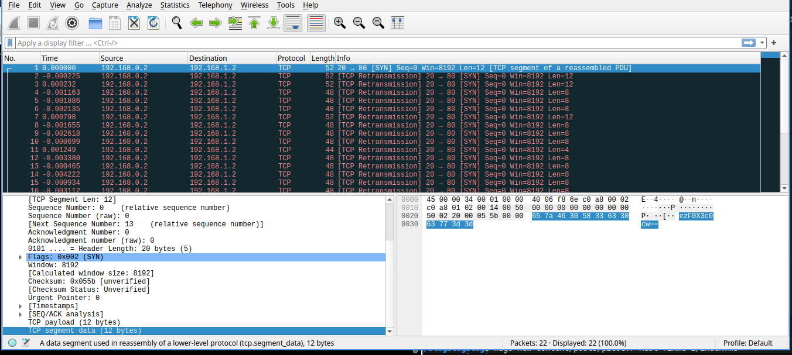

- URL: https://play.picoctf.org/practice/challenge/459
- Title: Ph4nt0m 1ntrud3r
- Tags: Easy, General Skills, picoCTF 2025, browser_webshell_solvable
- Author: Prince Niyonshuti N.
- _Started: 14 July 2025_
- _Solved: 14 July 2025_
- Description: 
> A digital ghost has breached my defenses, and my sensitive data has been stolen! 😱💻 Your mission is to uncover how this phantom intruder infiltrated my system and retrieve the hidden flag. To solve this challenge, you'll need to analyze the provided PCAP file and track down the attack method. The attacker has cleverly concealed his moves in well timely manner. Dive into the network traffic, apply the right filters and show off your forensic prowess and unmask the digital intruder! Find the PCAP file here [Network Traffic PCAP file](https://challenge-files.picoctf.net/c_verbal_sleep/a917f567b9cc0f1a730a7801b309955df4d2234a8114326857b9759e9e5d0453/myNetworkTraffic.pcap) and try to get the flag.

After downloading and opening in Wireshark I see that every packet has a segment of messages



I noticed this part of description, "The attacker has cleverly concealed his moves in well timely manner", I thought I should sort it based on time. Okay so the goal was these steps
1. Open the pcap file
2. Sort by time ascending
3. Get the TCP payload of each packet
4. Convert each TCP payload to string from bytes
5. Concatenate those

I ran these commands
```
# order by time ascending and output to file named sorted.pcap
reordercap myNetworkTraffic.pcap sorted.pcap

# use tshark command to read from sorted.pcap, filter packets that has tcp.payload
# make the output in the field only and the field is tcp.payload
tshark -r sorted.pcap -Y "tcp.payload" -T fields -e tcp.payload
```
To get the hexes

```
strikingsoul@ramones:~/Downloads$ tshark -r sorted.pcap -Y "tcp.payload" -T fields -e tcp.payload
6550525844696f3d
646756397630733d
6e6675345677773d
585468477875453d
434a72346f446b3d
544f47534767343d
636b426b5a4c6b3d
595145467a49553d
337073763543343d
6132332f5562493d
42674a4c4230633d
5974386b734d4d3d
666a497a51776b3d
62707a513052383d
4a3461755a4d593d
63476c6a62304e5552673d3d
657a46305833633063773d3d
626e52666447673064413d3d
587a4d3063336c6664413d3d
596d68664e484a664f513d3d
4e546c6d4e54426b4d773d3d
66513d3d
```
Then I needed to convert it to real string, I could use `xxd -r -p`. The r flag means reverse (from hexdump to binary), p flag means plain text (without ASCII column)

```
strikingsoul@ramones:~/Downloads$ tshark -r sorted.pcap -Y "tcp.payload" -T fields -e tcp.payload | xxd -r -p
ePRXDio=dgV9v0s=nfu4Vww=XThGxuE=CJr4oDk=TOGSGg4=ckBkZLk=YQEFzIU=3psv5C4=a23/UbI=BgJLB0c=Yt8ksMM=fjIzQwk=bpzQ0R8=J4auZMY=cGljb0NURg==ezF0X3c0cw==bnRfdGg0dA==XzM0c3lfdA==YmhfNHJfOQ==NTlmNTBkMw==fQ==
```

Okay it looked like the flag is encoded in base64. I could pipe the result to base64 --decode

```
strikingsoul@ramones:~/Downloads$ tshark -r sorted.pcap -Y "tcp.payload" -T fields -e tcp.payload | xxd -r -p | base64 --decode
x�W*v}�K���W
            ]8F����9L��▒r@dd�aޛ/�.km�Q�KGb�$��~23C      n���'��d�picoCTF{1t_w4snt_th4t_34sy_tbh_4r_959f50d3}
```
There it is! The final flag is `picoCTF{1t_w4snt_th4t_34sy_tbh_4r_959f50d3}`