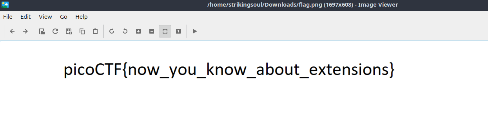

- URL: https://play.picoctf.org/practice/challenge/52
- Title: Extensions
- Tags:  Medium, Forensics, picoCTF 2019
- Author: Sanjay C/Danny
- _Started: 19 July 2025_
- _Solved: 19 July 2025_
- Description: 
> This is a really weird text file. Can you find the flag? Get the flag from [TXT](https://challenge-files.picoctf.net/c_fickle_tempest/31fe772e6a4c71e867af0b2a93818e06d8f8ebf8af2a9615495d00356ff576da/flag.txt).

After downloading the text file, I checked the integrity using `file` command

```
strikingsoul@ramones:~/Downloads$ file flag.txt 
flag.txt: PNG image data, 1697 x 608, 8-bit/color RGB, non-interlaced
```

It was actually a picture file

After renaming, I finally got the flag



The flag is `picoCTF{now_you_know_about_extensions}`