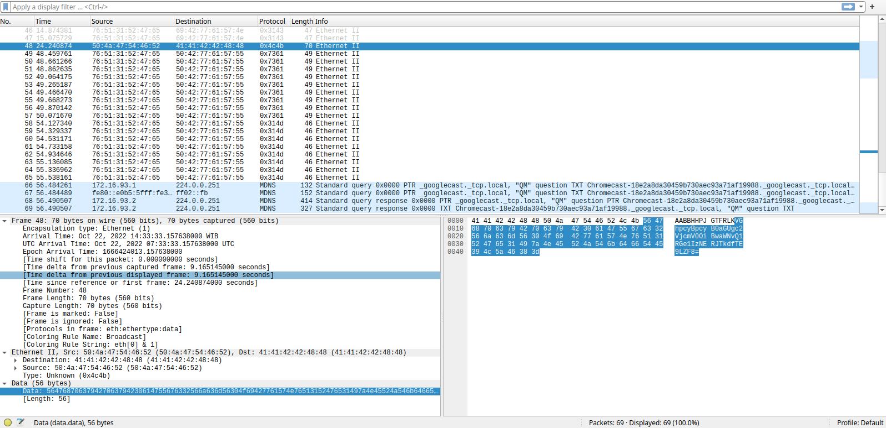

- URL: https://play.picoctf.org/practice/challenge/348
- Title: FindAndOpen
- Tags: Modern, Forensics, picoCTF 2023
- Author: 
- _Started: 16 July 2025_
- _Solved: 16 July 2025_
- Description: Mubarak Mikail
> Someone might have hidden the password in the trace file. Find the key to unlock [this file](https://artifacts.picoctf.net/c/496/flag.zip). [This tracefile](https://artifacts.picoctf.net/c/496/dump.pcap) might be good to analyze.

This one was kind of tricky. I opened `dump.pcap` using Wireshark and found this suspicious packet



The frame number was 48 so I used `tshark` for this one

```
strikingsoul@ramones:~/Downloads$ tshark -r dump.pcap -Y "frame.number == 48" -T fields -e data | xxd -r -p
VGhpcyBpcyB0aGUgc2VjcmV0OiBwaWNvQ1RGe1IzNERJTkdfTE9LZF8=
```

It seemed like another base64

```
strikingsoul@ramones:~/Downloads$ tshark -r dump.pcap -Y "frame.number == 48" -T fields -e data | xxd -r -p | base64 --decode
This is the secret: picoCTF{R34DING_LOKd_
```

Okay cool, the next was to use the first half as the password to extract `flag.zip`

```
strikingsoul@ramones:~/Downloads$ unzip flag.zip 
Archive:  flag.zip
[flag.zip] flag password: 
 extracting: flag                    
strikingsoul@ramones:~/Downloads$ cat flag
picoCTF{R34DING_LOKd_fil56_succ3ss_5ed3a878}
```

Finally, the flag is `picoCTF{R34DING_LOKd_fil56_succ3ss_5ed3a878}`