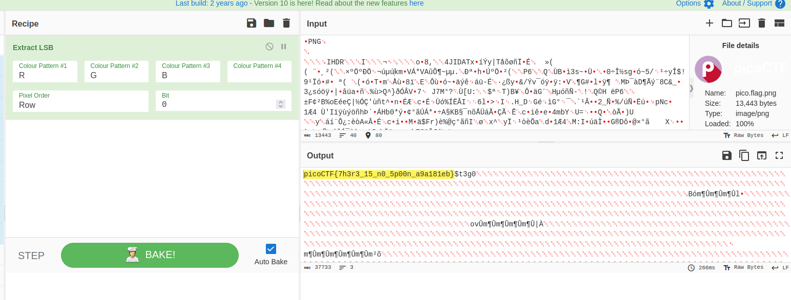

- URL: https://play.picoctf.org/practice/challenge/305
- Title: St3g0
- Tags: Medium, Forensics, picoCTF 2022, steganography
- Author: LT 'syreal' Jones (ft. djrobin17)
- _Started: 19 July 2025_
- _Solved: 19 July 2025_
- Description:
> Download this image and find the flag.
> [Download image](https://artifacts.picoctf.net/c/217/pico.flag.png)

This problem was actually the same as [What lies within](../picoCTF-what-lies-within/). I just used Cyberchef

