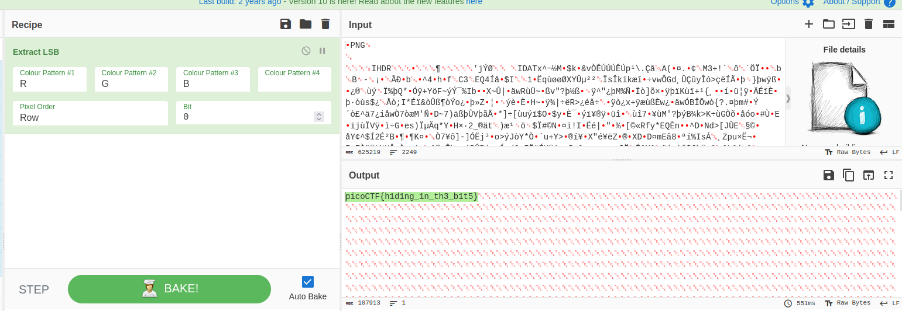

- URL: https://play.picoctf.org/practice/challenge/74
- Title: What Lies Within
- Tags: Medium, Forensics, picoCTF 2019
- Author: Julio/Danny
- _Started: 19 July 2025_
- _Solved: 19 July 2025_
- Description: 
> There's something in the [building](https://challenge-files.picoctf.net/c_fickle_tempest/c0eec6af0f04316e2bdc4a9f095afd0e2d0121f5e543dbc4a65bb0038d72a993/buildings.png). Can you retrieve the flag?

A picture and forensics tag, it was a steganography problem. I used Cyberchef to check

There it was! The flag is `picoCTF{h1d1ng_1n_th3_b1t5}`