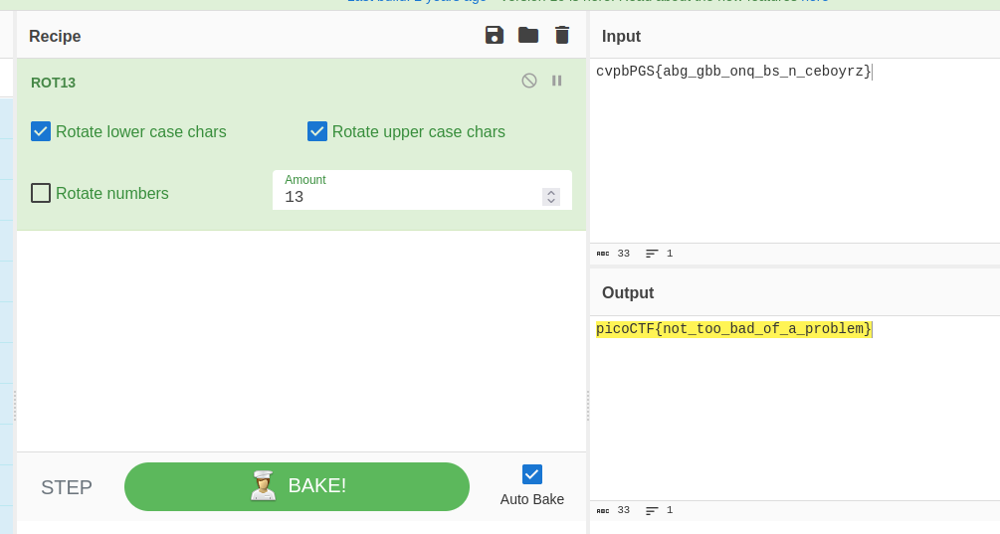

- URL: https://play.picoctf.org/practice/challenge/62
- Title: 13
- Tags: Easy, Cryptography, picoCTF 2019
- Author: Alex Fulton/Daniel Tunitis
- _Started: 20 July 2025_
- _Solved: 20 July 2025_
- Description: Cryptography can be easy, do you know what ROT13 is? cvpbPGS{abg_gbb_onq_bs_n_ceboyrz}

The encrypted flag is in the description. In fact, this is a similar problem to [Mod 26](../picoctf-mod26/). I just use my swiss-army knife for CTF which is CyberChef again.

`picoCTF{not_too_bad_of_a_problem}`

