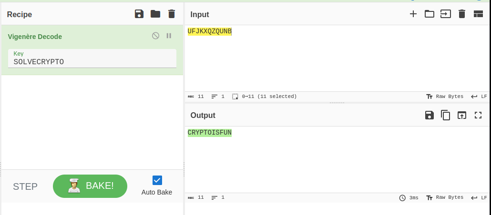

- URL: https://play.picoctf.org/practice/challenge/43
- Title: Easy1
- Tags: Medium, Cryptography, picoCTF 2019
- Author: Alex Fulton/Danny
- _Started: 27 July 2025_
- _Solved: 27 July 2025_
- Description: The one time pad can be cryptographically secure, but not when you know the key. Can you solve this? We've given you the encrypted flag, key, and a table to help UFJKXQZQUNB with the key of SOLVECRYPTO. Can you use this table to solve it?.

Here's the table from the given file

```
    A B C D E F G H I J K L M N O P Q R S T U V W X Y Z 
   +----------------------------------------------------
A | A B C D E F G H I J K L M N O P Q R S T U V W X Y Z
B | B C D E F G H I J K L M N O P Q R S T U V W X Y Z A
C | C D E F G H I J K L M N O P Q R S T U V W X Y Z A B
D | D E F G H I J K L M N O P Q R S T U V W X Y Z A B C
E | E F G H I J K L M N O P Q R S T U V W X Y Z A B C D
F | F G H I J K L M N O P Q R S T U V W X Y Z A B C D E
G | G H I J K L M N O P Q R S T U V W X Y Z A B C D E F
H | H I J K L M N O P Q R S T U V W X Y Z A B C D E F G
I | I J K L M N O P Q R S T U V W X Y Z A B C D E F G H
J | J K L M N O P Q R S T U V W X Y Z A B C D E F G H I
K | K L M N O P Q R S T U V W X Y Z A B C D E F G H I J
L | L M N O P Q R S T U V W X Y Z A B C D E F G H I J K
M | M N O P Q R S T U V W X Y Z A B C D E F G H I J K L
N | N O P Q R S T U V W X Y Z A B C D E F G H I J K L M
O | O P Q R S T U V W X Y Z A B C D E F G H I J K L M N
P | P Q R S T U V W X Y Z A B C D E F G H I J K L M N O
Q | Q R S T U V W X Y Z A B C D E F G H I J K L M N O P
R | R S T U V W X Y Z A B C D E F G H I J K L M N O P Q
S | S T U V W X Y Z A B C D E F G H I J K L M N O P Q R
T | T U V W X Y Z A B C D E F G H I J K L M N O P Q R S
U | U V W X Y Z A B C D E F G H I J K L M N O P Q R S T
V | V W X Y Z A B C D E F G H I J K L M N O P Q R S T U
W | W X Y Z A B C D E F G H I J K L M N O P Q R S T U V
X | X Y Z A B C D E F G H I J K L M N O P Q R S T U V W
Y | Y Z A B C D E F G H I J K L M N O P Q R S T U V W X
Z | Z A B C D E F G H I J K L M N O P Q R S T U V W X Y
```
The way to interpret the table is to
1. Look for the first alphabet of encrypted flag, find the alphabet in the row header
2. Loook for the second alphabet of the key, find the alphabet in the column header
3. Find the intersection of row and column header, that is the decrypted alphabet
4. Repeat until the last alphabet.

Let's do it one by one, shall we

| Encrypted | Key | Decrypted |
| --------- | --- | --------- |
| U         | S   | C         |
| F         | O   | R         |
| J         | L   | Y         |
| K         | V   | P         |
| X         | E   | T         |
| Q         | C   | O         |
| Z         | R   | I         |
| Q         | Y   | S         |
| U         | P   | F         |
| N         | T   | U         |
| B         | O   | N         |

There it is! The decrypted flag is `CRYPTOISFUN`. Before submitting, keep in mind that in picoCTF, every flag is encapsulated by `picoCTF{your_flag}`. Therefore the answer is

`picoCTF{CRYPTOISFUN}`

## About Vigenere Cipher

The table above is tabulation of Vigenere Cipher. Vigenere Cipher is a way to encrypt and decrypt alphabetic text. According to [G4G](https://www.geeksforgeeks.org/dsa/vigenere-cipher/), the rules are
- A table consists of 26 alphabets written out 26 times in different rows, each alphabet shifted cyclically to the left compared to the previous alphabet, corresponding to the 26 possible Caesar Ciphers.
- At different points in the encryption process, the cipher uses a different alphabet from one of the rows.
- The alphabet used at each point depends on a repeating keyword.

For this problem, it's easier to use external tools such as CyberChef

