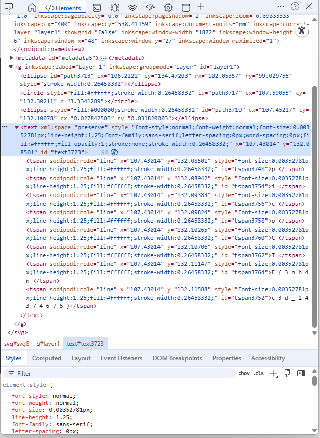

- URL: https://play.picoctf.org/practice/challenge/265
- Title: Enhance!
- Tags: Medium, Forensics, picoCTF 2022, svg
- Author: LT 'syreal' Jones
- _Started: 18 July 2025_
- _Solved: 18 July 2025_
- Description: Download this image file and find the flag.

When I opened the `drawing.flag.svg`, this image appears

Tinkering around with the browser DevTools and inspecting the elements, I found interesting tspans

There you have it, just concatenate all inner values of tspans

`p i c o C T F { 3 n h 4 n c 3 d _ 2 4 3 7 4 6 7 5 }`

and then remove spaces between each characters

`picoCTF{3nh4nc3d_24374675}`