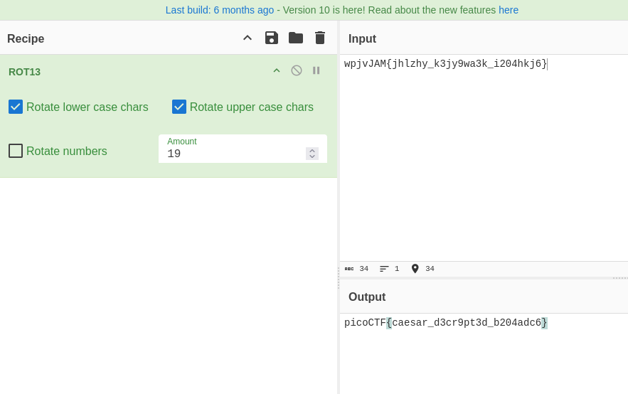

- URL: https://play.picoctf.org/practice/challenge/418
- Title: interencdec
- Tags: Easy, Cryptography, picoCTF 2024, base64, browser_webshell_solvable
- Author: NGIRIMANA Schadrack
- _Started: 20 July 2025_
- _Solved: 20 July 2025_
- Description: Can you get the real meaning from this file. Download the file here.

After downloading the file, I displayed the content

```
strikingsoul@ramones:~/Downloads$ cat enc_flag 
YidkM0JxZGtwQlRYdHFhR3g2YUhsZmF6TnFlVGwzWVROclgya3lNRFJvYTJvMmZRPT0nCg==
```

After a base64 decode, there flag is still encrypted

```
strikingsoul@ramones:~/Downloads$ cat enc_flag | base64 --decode
b'd3BqdkpBTXtqaGx6aHlfazNqeTl3YTNrX2kyMDRoa2o2fQ=='
```

```
d3BqdkpBTXtqaGx6aHlfazNqeTl3YTNrX2kyMDRoa2o2fQ==
```

After decoded once again, the message is still gibberish

```
strikingsoul@ramones:~/Downloads$ echo d3BqdkpBTXtqaGx6aHlfazNqeTl3YTNrX2kyMDRoa2o2fQ== | base64 --decode
wpjvJAM{jhlzhy_k3jy9wa3k_i204hkj6}
```

Okay, I thought it was a caesar cipher



The final flag is `picoCTF{caesar_d3cr9pt3d_b204adc6}`