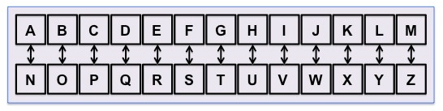
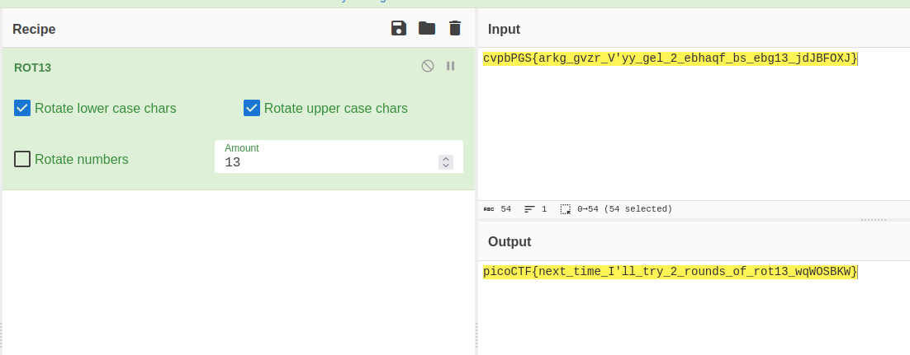

- URL: https://play.picoctf.org/practice/challenge/144
- Title: Mod 26
- Tags: Cryptography, Easy, picoCTF 2021
- Author: PANDU
- _Started: 20 July 2025_
- _Solved: 20 July 2025_
- Description: Cryptography can be easy, do you know what ROT13 is? values.txt

`values.txt` contains this text

`cvpbPGS{arkg_gvzr_V'yy_gel_2_ebhaqf_bs_ebg13_45559noq}`

As stated by definition, I was expected to decrypt the flag using ROT13. ROT13 is a way to decrypt and encrypt an alphabetic text by shifting its order cyclically by 13. A becomes N, B becomes M, et cetera. Below is the table

Just like XOR, ROT13 also has the same method of encryption and decryption. I happened to use Cyberchef to make it easier. If you want to make your own script, remember to ignore nonalphabetic character when encrypting/decrypting

`picoCTF{next_time_I'll_try_2_rounds_of_rot13_45559abd}`