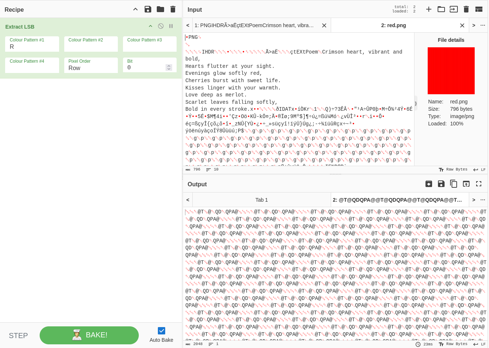
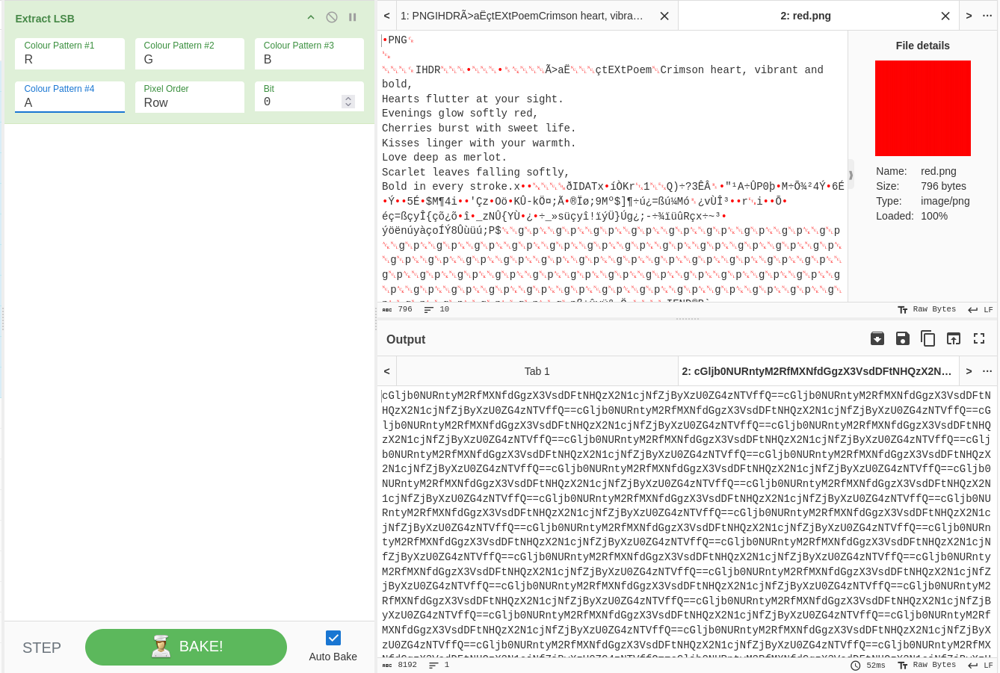

Heya! This is my first post migrating from [this post](../picoctf) so you guys don't get overwhelmed by the length of the post.

---

- URL: https://play.picoctf.org/practice/challenge/460
- Title: RED
- Tags: Easy, Forensics, picoCTF, browser_webshell_solvable
- Author: SHUAILIN PAN (LECONJUROR)
- _Started: 7 July 2025_
- _Solved: 7 July 2025_
- Description: RED, RED, RED, RED

I was given this .png file


And from the third hint, "Check whatever Facebook is called now" which is _meta_, I checked the metadata using `identify verbose ./red.png`

```
Image:
  Filename: red.png
  Permissions: rw-rw-r--
  Format: PNG (Portable Network Graphics)
  Mime type: image/png
  Class: DirectClass
  Geometry: 128x128+0+0
  Units: Undefined
  Colorspace: sRGB
  Type: TrueColorAlpha
  Base type: Undefined
  Endianness: Undefined
  Depth: 8-bit
  Channel depth:
    red: 8-bit
    green: 8-bit
    blue: 8-bit
    alpha: 8-bit
  Channel statistics:
    Pixels: 16384
    Red:
      min: 254  (0.996078)
      max: 255 (1)
      mean: 254.219 (0.996936)
      standard deviation: 0.413411 (0.00162122)
      kurtosis: -0.158353
      skewness: 1.36055
      entropy: 0.757878
    Green:
      min: 0  (0)
      max: 1 (0.00392157)
      mean: 0.6875 (0.00269608)
      standard deviation: 0.463527 (0.00181775)
      kurtosis: -1.34566
      skewness: -0.808966
      entropy: 0.896038
    Blue:
      min: 0  (0)
      max: 1 (0.00392157)
      mean: 0.5625 (0.00220588)
      standard deviation: 0.496094 (0.00194546)
      kurtosis: -1.93664
      skewness: -0.251953
      entropy: 0.988699
    Alpha:
      min: 254  (0.996078)
      max: 255 (1)
      mean: 254.406 (0.997672)
      standard deviation: 0.491147 (0.00192607)
      kurtosis: -1.858
      skewness: 0.381738
      entropy: 0.974489
  Image statistics:
    Overall:
      min: 0  (0)
      max: 255 (1)
      mean: 127.469 (0.499877)
      standard deviation: 0.466045 (0.00182763)
      kurtosis: -1.99997
      skewness: -1.81542e-06
      entropy: 0.904276
  Colors: 14
  Histogram:
           384: (254,0,0,255) #FE0000FF srgba(254,0,0,1)
           256: (254,0,0,254) #FE0000FE srgba(254,0,0,0.996078)
          1664: (254,0,1,255) #FE0001FF srgba(254,0,1,1)
           768: (254,0,1,254) #FE0001FE srgba(254,0,1,0.996078)
          2816: (254,1,0,254) #FE0100FE srgba(254,1,0,0.996078)
          2176: (254,1,0,255) #FE0100FF srgba(254,1,0,1)
          3072: (254,1,1,254) #FE0101FE srgba(254,1,1,0.996078)
          1664: (254,1,1,255) #FE0101FF srgba(254,1,1,1)
           640: (255,0,0,254) #FF0000FE srgba(255,0,0,0.996078)
           256: (255,0,0,255) #FF0000FF red
          1152: (255,0,1,254) #FF0001FE srgba(255,0,1,0.996078)
           512: (255,1,0,255) #FF0100FF srgba(255,1,0,1)
           128: (255,1,0,254) #FF0100FE srgba(255,1,0,0.996078)
           896: (255,1,1,254) #FF0101FE srgba(255,1,1,0.996078)
  Rendering intent: Perceptual
  Gamma: 0.454545
  Chromaticity:
    red primary: (0.64,0.33,0.03)
    green primary: (0.3,0.6,0.1)
    blue primary: (0.15,0.06,0.79)
    white point: (0.3127,0.329,0.3583)
  Background color: white
  Border color: srgba(223,223,223,1)
  Matte color: grey74
  Transparent color: none
  Interlace: None
  Intensity: Undefined
  Compose: Over
  Page geometry: 128x128+0+0
  Dispose: Undefined
  Iterations: 0
  Compression: Zip
  Orientation: Undefined
  Properties:
    date:create: 2025-12-14T02:34:19+00:00
    date:modify: 2025-12-14T02:34:05+00:00
    date:timestamp: 2025-12-14T03:01:32+00:00
    png:IHDR.bit-depth-orig: 8
    png:IHDR.bit_depth: 8
    png:IHDR.color-type-orig: 6
    png:IHDR.color_type: 6 (RGBA)
    png:IHDR.interlace_method: 0 (Not interlaced)
    png:IHDR.width,height: 128, 128
    png:text: 1 tEXt/zTXt/iTXt chunks were found
    Poem: Crimson heart, vibrant and bold,
Hearts flutter at your sight.
Evenings glow softly red,
Cherries burst with sweet life.
Kisses linger with your warmth.
Love deep as merlot.
Scarlet leaves falling softly,
Bold in every stroke.
    signature: 55637daa411b97df8ec915c1d3eedfa70d396e1e24a2b46fa6b94077419021a3
  Artifacts:
    filename: red.png
    verbose: true
  Tainted: False
  Filesize: 796B
  Number pixels: 16384
  Pixels per second: 18.6543MB
  User time: 0.000u
  Elapsed time: 0:01.000
  Version: ImageMagick 6.9.12-98 Q16 x86_64 18038 https://legacy.imagemagick.org
```

I want you to focus on this part

```
Crimson heart, vibrant and bold,
Hearts flutter at your sight.
Evenings glow softly red,
Cherries burst with sweet life.
Kisses linger with your warmth.
Love deep as merlot.
Scarlet leaves falling softly,
Bold in every stroke.
```

Focus on the first character on each line. CHECKLSB. I happened to know a tool called [CyberChef](https://gchq.github.io/CyberChef/) and it has the exact tool called Extract LSB. Open the file as input first



We need params for Color Pattern number 1 till 3. Fortunately, I was given the second hint "Red?Ged?Bed?Aed?". RGBA.



I noticed a repeating pattern of

`cGljb0NURntyM2RfMXNfdGgzX3VsdDFtNHQzX2N1cjNfZjByXzU0ZG4zNTVffQ==`

Double `=` indicates that it is a result of base64 encoding. So I decoded it and found

`picoCTF{r3d_1s_th3_ult1m4t3_cur3_f0r_54dn355_}`

--- 

I just found out you don't have to use your mouse to select all of the output in the terminal. Just install `xclip` package and pipe your result to `xclip -sel clip` .e.g. `cat file | xclip -sel clip` you then can paste it wherever.

I also just found out about that `identify -verbose` command, before then I used https://exif.tools/ or https://www.metadata2go.com/.