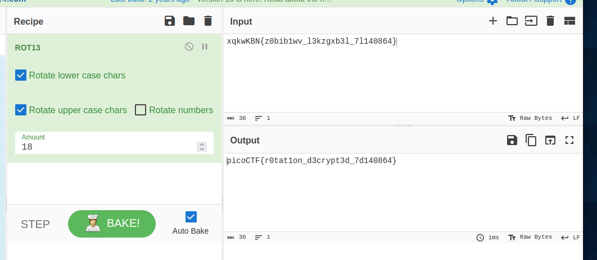

- URL: https://play.picoctf.org/practice/challenge/373
- Title: rotation
- Tags: Medium, Cryptography, picoCTF 2023
- Author: Loic Shema
- _Started: 21 July 2025_
- _Solved: 21 July 2025_
- Description: You will find the flag after decrypting this file Download the encrypted flag here.

File downloaded contains this text

`xqkwKBN{z0bib1wv_l3kzgxb3l_7l140864}`

The hint and title suggested that I could use ROTX to get the flag. Even so, I didn't know what is the number for the right rotation. Well, we can always try, right?

It turned out to be ROT18 and the flag is

`picoCTF{r0tat1on_d3crypt3d_7d140864}`