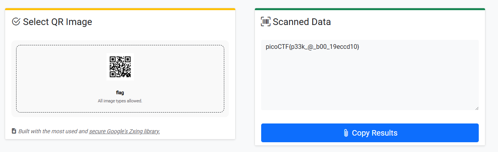

- URL: https://play.picoctf.org/practice/challenge/444
- Title: Scan Surprise
- Tags: Easy, Forensics, picoCTF 2024, browser_webshell_solvable, shell, qr_code
- Author: Jeffery John
- _Started: 15 July 2025_
- _Solved: 15 July 2025_
- Description: I've gotten bored of handing out flags as text. Wouldn't it be cool if they were an image instead?
You can download the challenge files here:
challenge.zip
Additional details will be available after launching your challenge instance.

First, I had to download challenge.zip and start the instance.

I extracted the .zip file and within nested folder, I found flag.png which contains a QR code


Here's the description after I started the instance

```
The same files are accessible via SSH here:
ssh -p 63089 ctf-player@atlas.picoctf.net
Using the password 1db87a14. Accept the fingerprint with yes, and ls once connected to begin. Remember, in a shell, passwords are hidden!
```

You can just use online decoder such as https://scanqr.org/ to get the string



or if you want to seem "hackery", you can use zbarimg and refer to [this documentation](https://www.baeldung.com/linux/read-qr-codes)

```
┌─[slayingsoul@parrot]─[~/Downloads/home/ctf-player/drop-in]
└──╼ $zbarimg flag.png 
QR-Code:picoCTF{p33k_@_b00_19eccd10}
scanned 1 barcode symbols from 1 images in 0,01 seconds
```

###### About QR code

There's marvelous engineering behind a QR code, the QR code itself ensures 360 degree scanability, and error correction. Also, keep in mind that a QR code can store up to 4296 alphanumeric character. You can check [this video](https://www.youtube.com/watch?v=pamazHwk0hg) to enrich your knowledge.