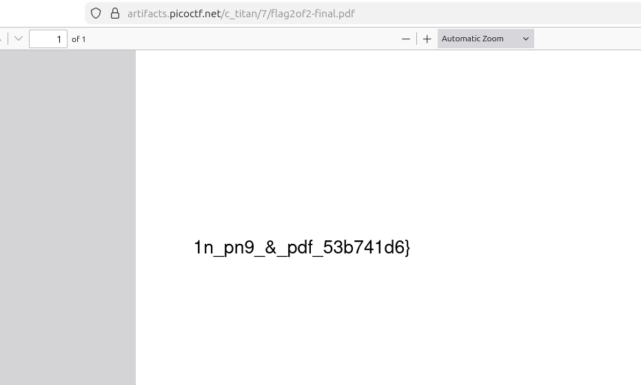
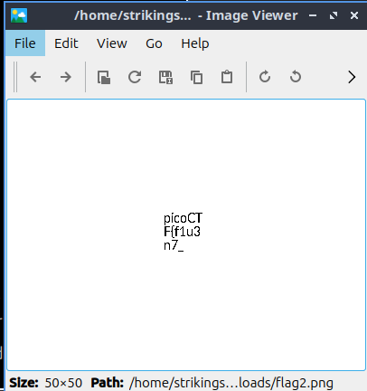

- URL: https://play.picoctf.org/practice/challenge/423
- Title: RED
- Tags: Easy, Forensics, picoCTF 2024, file_format, polyglot
- Author: SYREAL
- _Started: 15 July 2025_
- _Solved: 15 July 2025_
- Description: The Network Operations Center (NOC) of your local institution picked up a suspicious file, they're getting conflicting information on what type of file it is. They've brought you in as an external expert to examine the file. Can you extract all the information from this strange file? Download the suspicious file here. 

After downloading `flag2of2.pdf`, my browser automatically showed the pdf



`1n_pn9_&_pdf_53b741d6}`

It was one part of the flag. According to the tag, I should check the file using `file` command

```
strikingsoul@ramones:~/Downloads$ file flag2of2-final.pdf 
flag2of2-final.pdf: PNG image data, 50 x 50, 8-bit/color RGBA, non-interlaced
```

It was actually a png! So I change the file extension and voila!



`picoCTF{f1u3n7_`

Combining those parts, I got

`picoCTF{f1u3n7_1n_pn9_&_pdf_53b741d6}`

