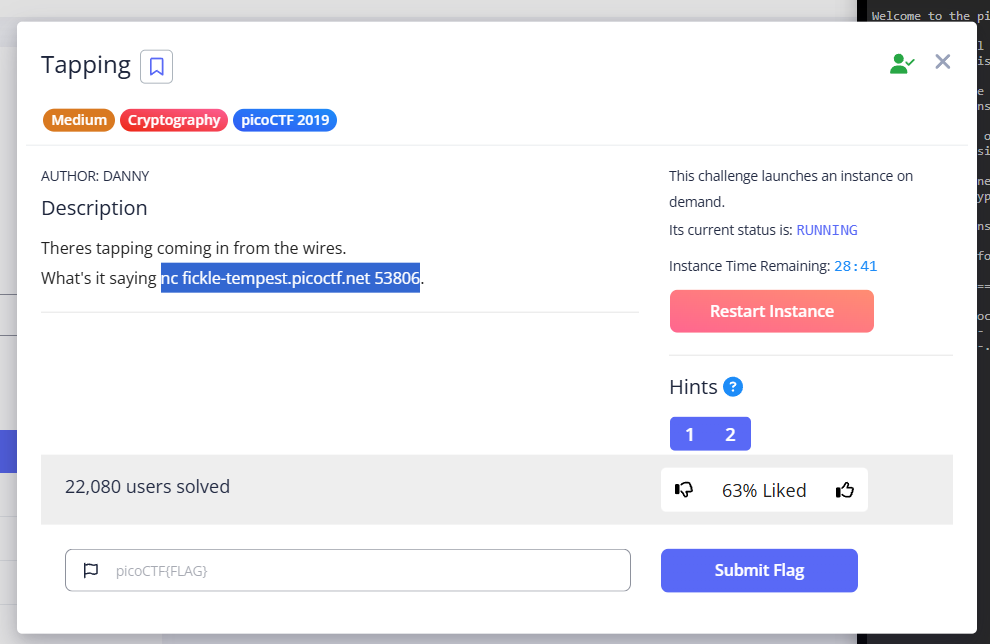
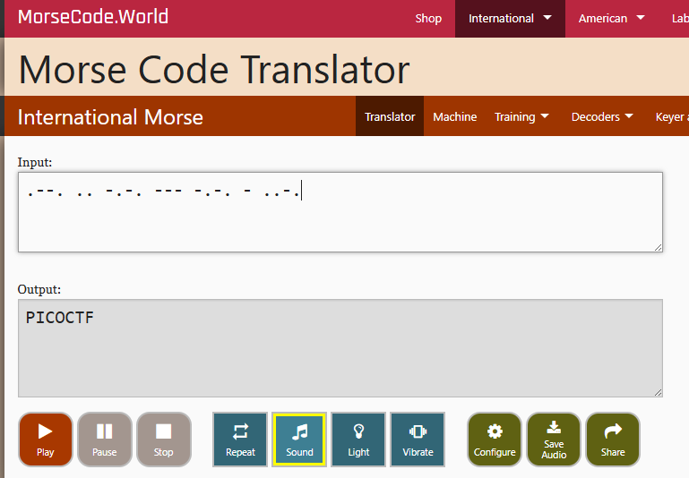
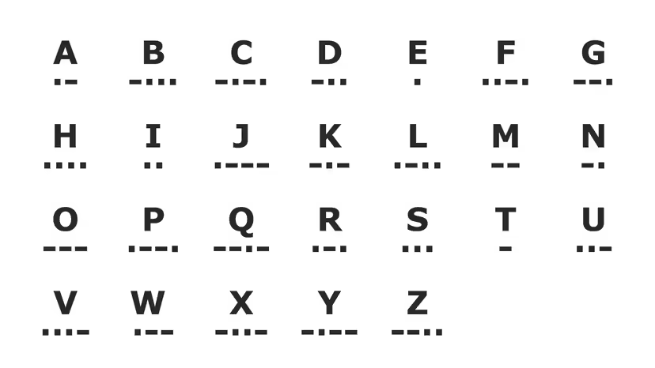

- URL: https://play.picoctf.org/practice/challenge/21
- Title: Tapping
- Tags: Medium, Cryptography, picoCTF 2019
- Author: DANNY
- _Started: 27 July 2025_
- _Solved: 27 July 2025_
- Description: Theres tapping coming in from the wires.
Additional details will be available after launching your challenge instance.

I started the instance, and copied this `nc` command snippet.



The host returned this information.

```
buddyhearto-picoctf@webshell:~$ nc fickle-tempest.picoctf.net 53806
.--. .. -.-. --- -.-. - ..-. { -- ----- .-. ... ...-- -.-. ----- -.. ...-- .---- ... ..-. ..- -. -.-. ----. .---- ..-. -.... ..--- ----- -.... } 
```

In primary school, I used to memorize _morse code_, but now I can just use online translator at this point. This is the first part before `{`

And this is the part encapsulated within `{}`


The final flag is

```PICOCTF{M0RS3C0D31SFUNC91F6206}```

---

###### About Morse Code

As far as I know, Morse Code is a "language" used to translate telegraph transmission to a sequence of letters (and numbers if needed). These characters are coded to combinations of "dots", and "dashes". We can utilize electrical pulse, flute sound, and even eyeblinks to transmit Morse Code. Here's the translation.



I want you to remember the easiest which is "SOS" or ...---... or dot-dot-dot-dash-dash-dash-dot-dot-dot. It's easy and it's very important in grave danger.