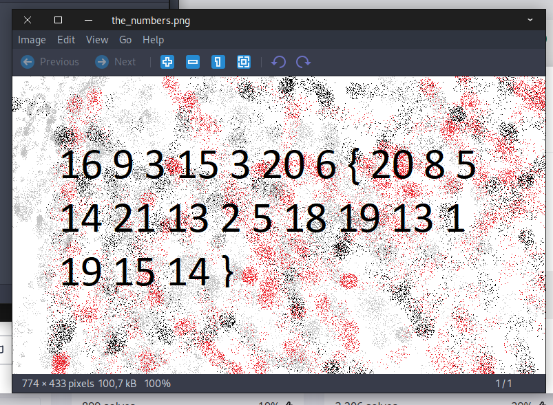
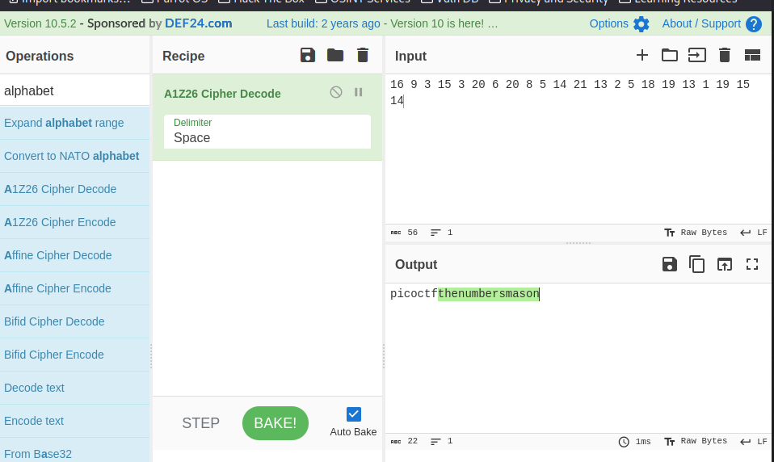

- URL: https://play.picoctf.org/practice/challenge/68
- Title: RED
- Tags: Easy, Cryptography, picoCTF 2019,
- Author: Danny
- _Started: 20 July 2025_
- _Solved: 20 July 2025_
- Description: The numbers... what do they mean? numbers.png

Opening numbers.png, it showed this

I noticed the curly brackets and the 4 starting numbers: 16, 9, 3, 15. If you align it with alphabet order. I could just use pen and paper or even code about it but in this case I used CyberChef, the algorithm is called A1Z16

The flag is `picoCTF{thenumbersmason}`