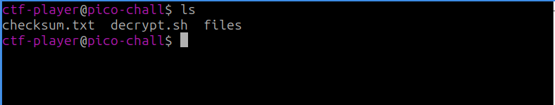
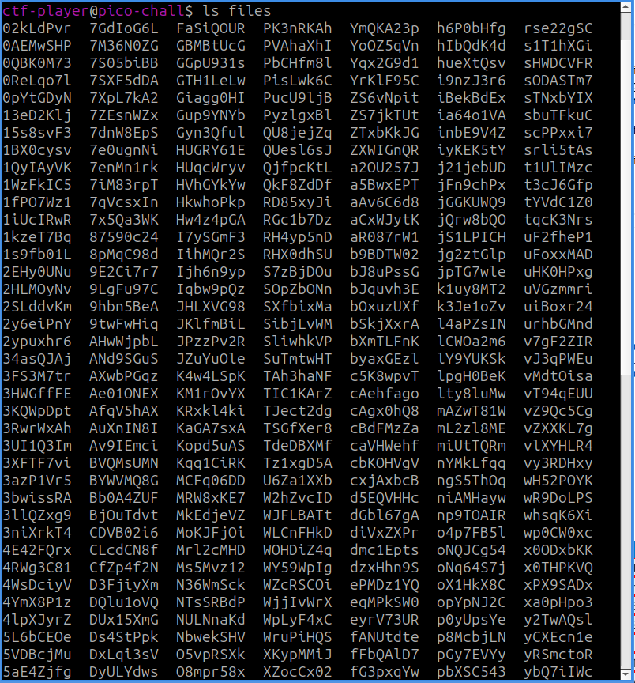
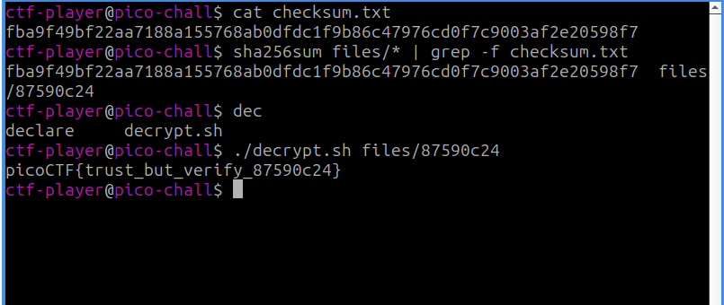

- URL: https://play.picoctf.org/practice/challenge/450
- Title: Verify
- Tags: Easy, Forensics, picoCTF 2024, grep, browser_webshell_solvable, checksum
- Author: Jeffery John
- _Started: 14 July 2025_
- _Solved: 14 July 2025_
- Description: People keep trying to trick my players with imitation flags. I want to make sure they get the real thing! I'm going to provide the SHA-256 hash and a decrypt script to help you know that my flags are legitimate.

Additional details will be available after launching your challenge instance.

First, I ssh'ed into the server using given username and password after I ran the instance. I listed all the files in the home folder and ~/files

There were a lot of files in ~/files and one of them is the real flag. I was given the real checksum in form of `checksum.txt` and here's what I would do
1. Create a checksum of all files in ~/files
2. Pipe the output to grep to grab a line containing the same checksum and the file
3. Use `~/decrypt.sh` to decrypt the file

Here you go, the flag is

`picoCTF{trust_but_verify_87590c24}`

###### About SHA256

Secure Hashing Algorithm 256 is a hashing algorithm (duh). Hashing means you convert a plain text to a hashed text with a hash function and there is no way to convert it back to plain text. It's one-way only, it's different from encryption which is two-way if you have the key. Say you downloaded a file from the internet, there's a risk that the file is modified and it's not the same as the file in the server. So the publisher would put SHA256 checksum in their website and you generate a checksum of downloaded file. If they're identical, you can confirm that the file maintains its integrity.