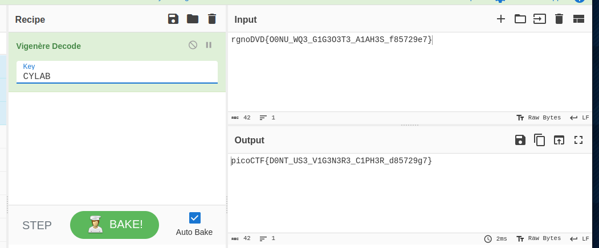

- URL: https://play.picoctf.org/practice/challenge/316
- Title: Vigenere
- Tags: Medium, Cryptography, picoCTF 2022
- Author: Mubarak Mikail
- _Started: 21 July 2025_
- _Solved: 21 July 2025_
- Description: Can you decrypt this message? Decrypt this message using this key "CYLAB".

The text file contains

`rgnoDVD{O0NU_WQ3_G1G3O3T3_A1AH3S_f85729e7}`

The method is the same as [easy1](../picoctf-easy1/)

`picoCTF{D0NT_US3_V1G3N3R3_C1PH3R_d85729g7}`