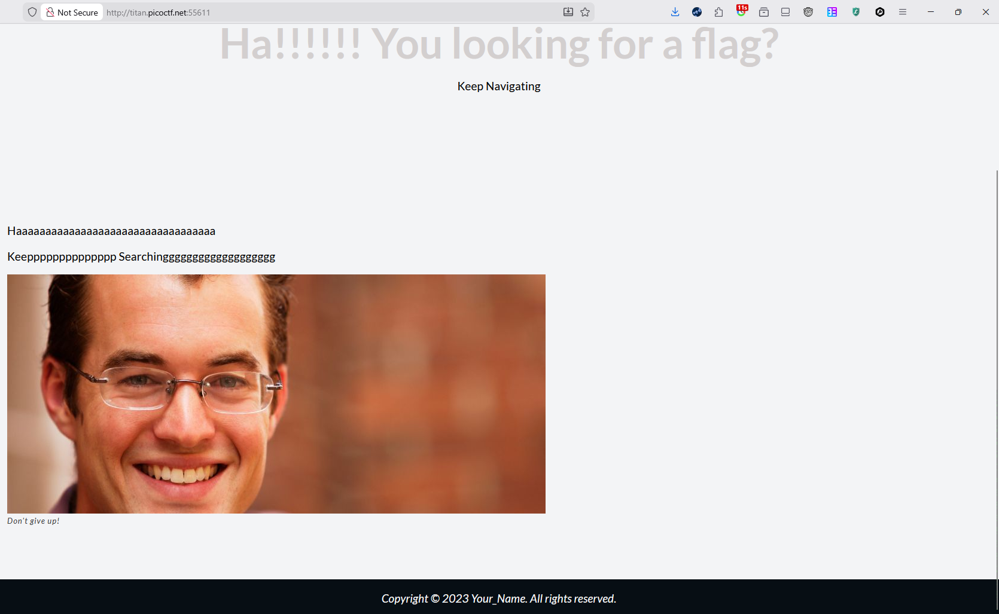
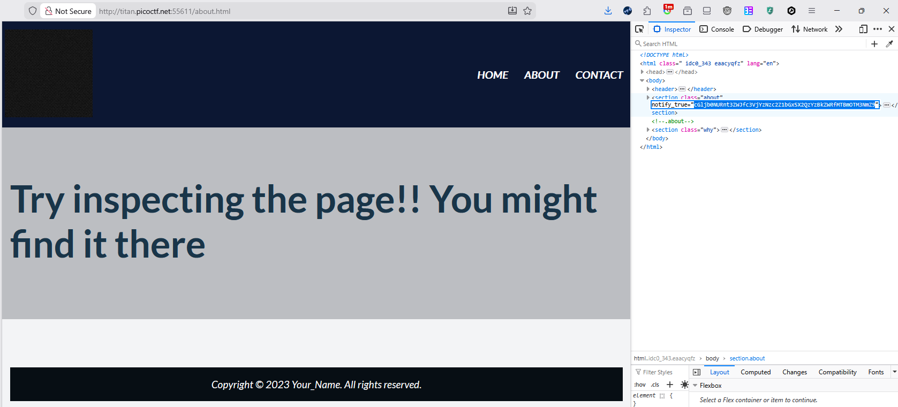
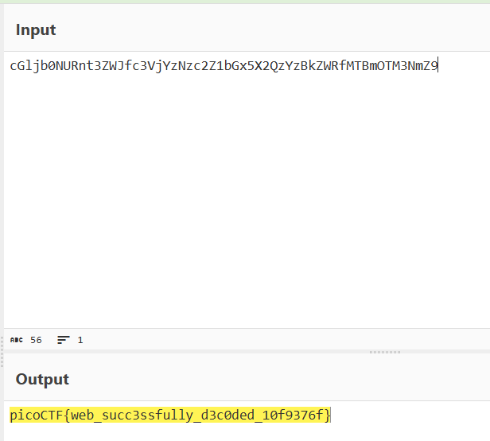

- URL: https://play.picoctf.org/practice/challenge/427
- Title: WebDecode
- Tags: Easy, Web Exploitation, picoCTF 2024, browser_webshell_solvable
- Author: Nana Ama Atombo-Sackey
- _Started: 9 July 2025_
- _Solved: 9 July 2025_
- Description: Do you know how to use the web inspector? Additional details will be available after launching your challenge instance.

The website appeared to be trolling 😬

According to the description, I was expected to inspect the web using devtools. There were 3 files, `index.html`, `about.html`, `contact.html`

After inspecting `about.html`, it shows a message and a section element with a strange attibute value.

`cGljb0NURnt3ZWJfc3VjYzNzc2Z1bGx5X2QzYzBkZWRfMTBmOTM3NmZ9`

Usually for these challenges, the flag is encrypted using base64

`

`picoCTF{web_succ3ssfully_d3c0ded_10f9376f}`