+++
date = '2025-07-14T22:27:28+07:00'
draft = false
title = 'PicoCTF'
tags = ['english', 'it']
+++
## **SPOILER**
I don't recommend you read this article before you _actually_ try to solve some of the problems! Try your best first dude. You won't learn anything if you just jump to the answer without any thinking.

## Flag
Here's my write-up of my solutions when I try to solve some of PicoCTF's problems. You can use `Ctrl+F` to search. I will try my best to explain my thought process. I actually solved some of them but I want to document my solution so that people know. The flag will be in the form of picoCTF{flag}.

## Easy
I'll try to solve the easy ones.
### DISKO 1, Started and Finished 7 July 2025
We're challenged to find the flag in a disk image. To download the disk image, we use `wget` command and put in the url.

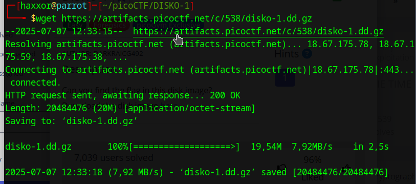

As we can see, the disk image is in the format of `dd.gz` to it's compressed in a gzip format. First, I think we should try to unzip it.

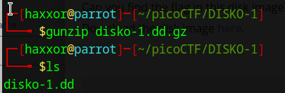

And I happened to know that we can use `strings` command to find human-readable string in a byte-type file

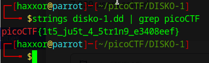
### Fantasy CTF, Started and Finished 7 July 2025
First, I tried to run the command provided.

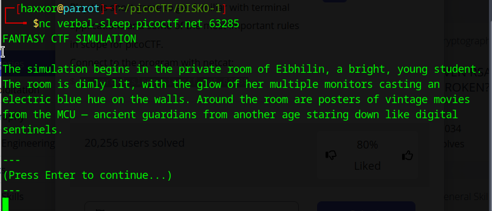

I was shown a story...I'll try to follow along. And after trials and errors, it gives me the flag

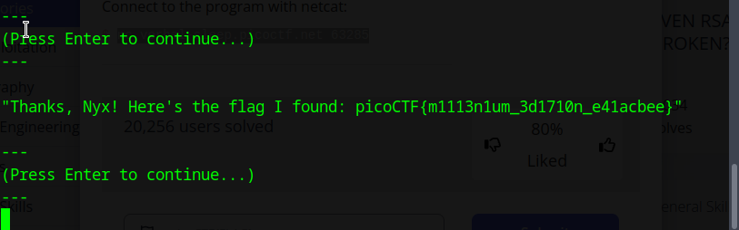

### RED, Started and Finished 7 July 2025

So I downloaded the `red.png` and checked the metadata

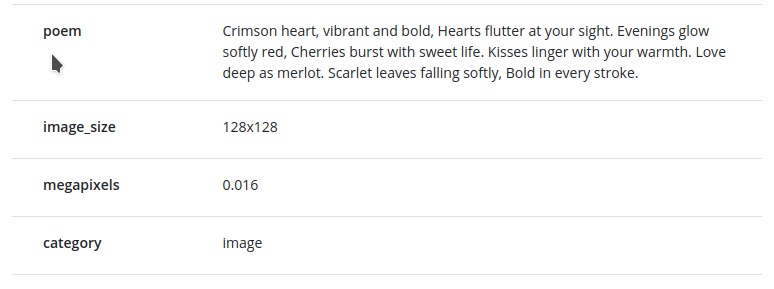

What? A poem? I tried to list all capital letters which gave me "CHECK LSB". I searched for "lsb in image" and DuckDuckGo returned results about Least Significant Bit

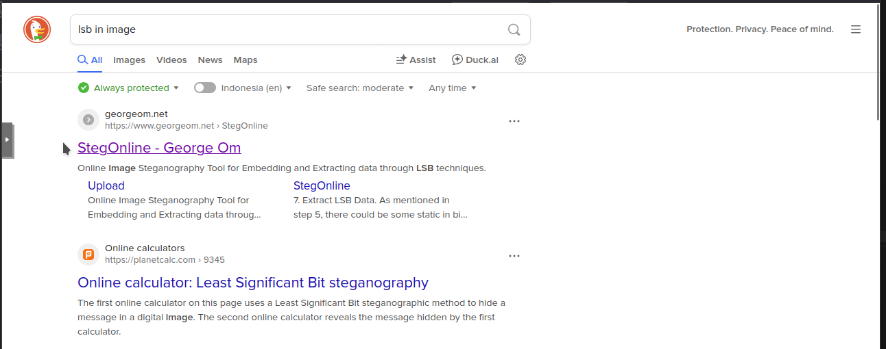

I went to Cyberchef and put `Extract LSB` to my recipe. From the hint, `Red?Ged?Bed?Aed?` it's provided that the color pattern is RGBA

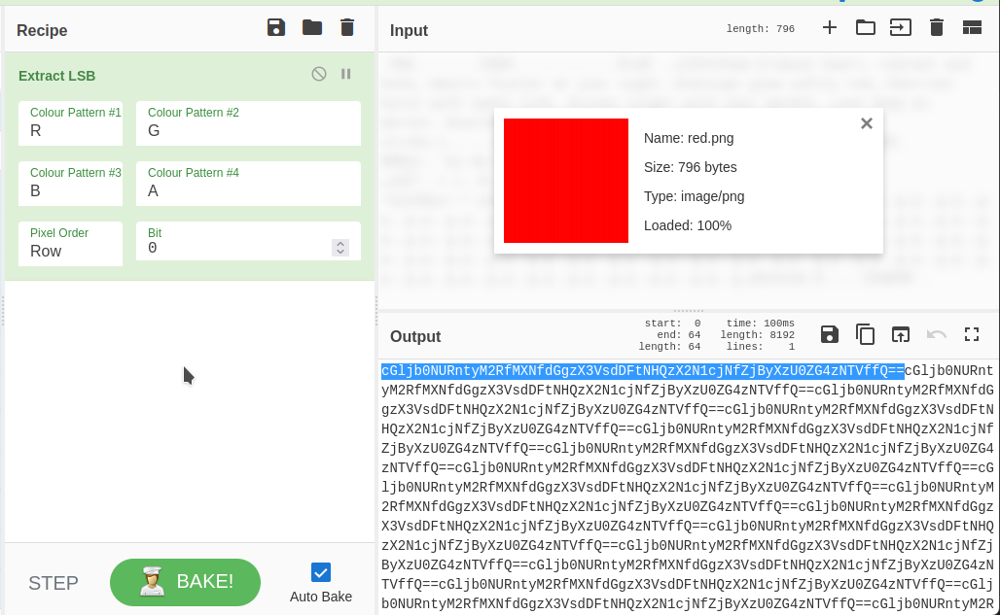

I noticed that from the output there's a repeating pattern. I suspect that it's a Base64

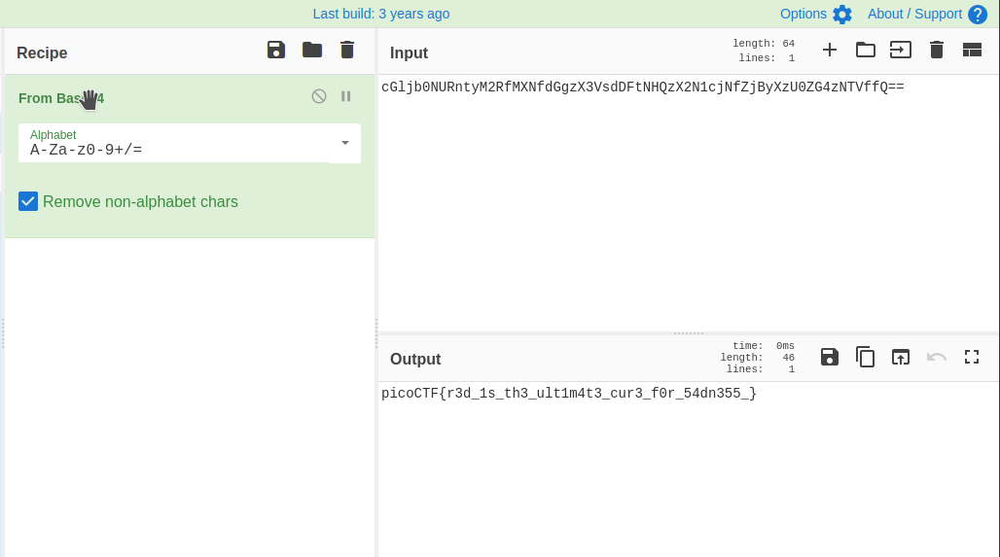
### rust fixme 1, Started 7 July 2025, Finished 9 July 2025
I downloaded the file using wget and extracted it using gunzip and tar

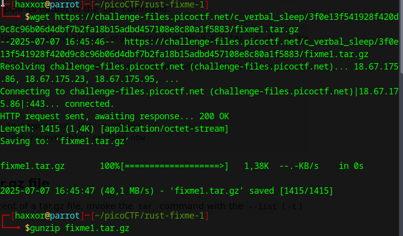

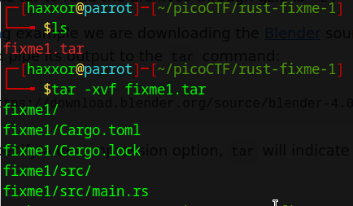

OK, but first we have to install Rust, just follow the instruction from [this page](https://www.rust-lang.org/tools/install)

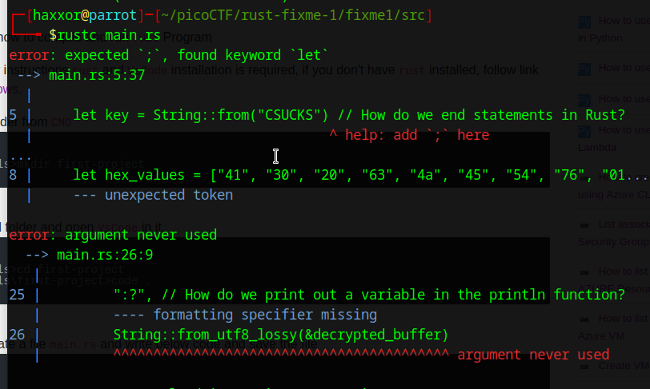

Great, the errors are displayed. Now it's time to edit. I added a semicolon, corrected "return" statement, and fixed println. Unfortunately my VM in homelab ran out of memory and I had to fix reboot it. We're back to VM in my PC because well...my homelab has insufficient RAM.

I'm back, let's continue. From my little programming experience (C mainly), I had to make sure that every line ends with semicolon (;), if we want to exit from a function use "return". For the println part, I searched and found that I had to use curly braces ({}). To compile, execute `cargo build` in the working directory and the compiled file is in `./target/debug`.

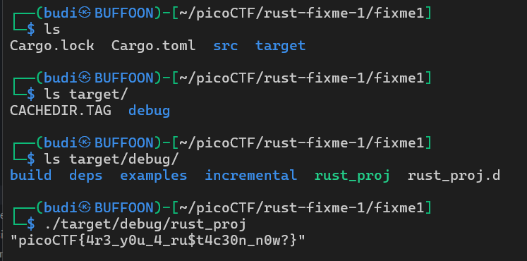

### rust fixme 2, Started 9 July 2025
First, the spadework just like _rust fixme 1_

I like to build/compile the project and then see the errors.

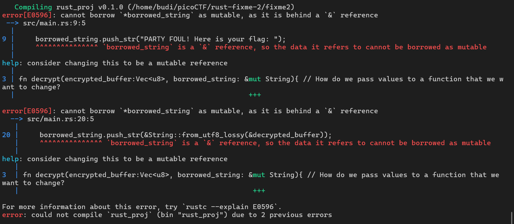

And from the errors we got the hint. I fixed some of them. Another error.

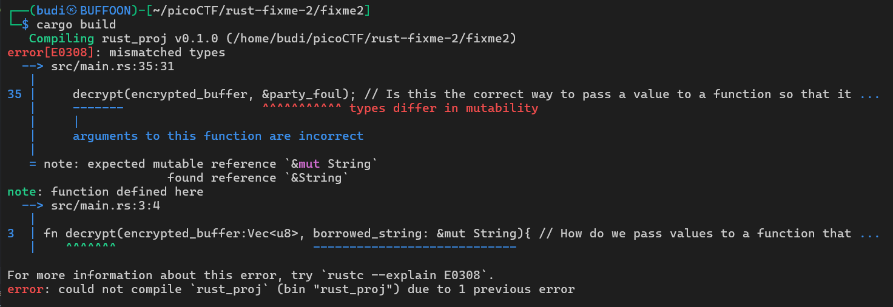

(To be continued)

### Binary Search, Started and Finished 9 July 2025

I immediately ssh'ed to the instance. I had to guess a number ranging from 1 to 1000 under 10 guesses. Hinted from the title, I had to add the upper range and lower range and divide it by 2, effectively doing a Binary Search.

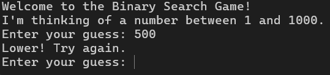

Now we do between 1 and 500

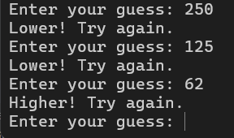

Fast forward, it took me 10 guesses, whew

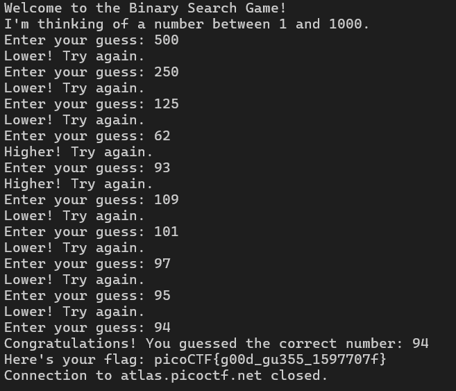

### WebDecode, Started and Finished 9 July 2025

I was given a website and I had to find it using web inspector just like the detail of the problem suggested. I tried inspecting `index.html` and found nothing. But something caught my eye in `about.html`

Yeah it must be base64 again.

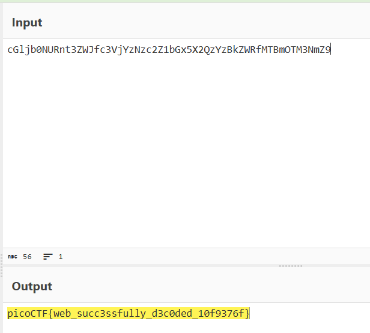

### Ph4nt0m 1ntrud3r, Started and Finished 14 July 2025

I was given a PCAP file and it's about network traffic. I didn't know a damn thing about it but from my conscience I knew it has something to do with Wireshark. So I opened it in Wireshark.

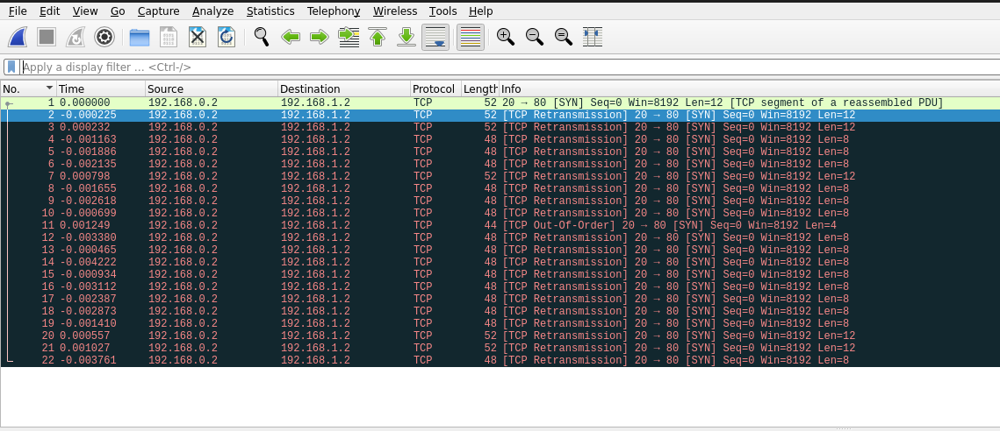

From the hint, it's all about time so I sorted it by time and starts decoding the last part of each payload _from the bottom_ and I got this

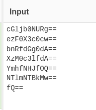

And it's suspiciously a base64 and I decoded it with cyberchef and got the flag

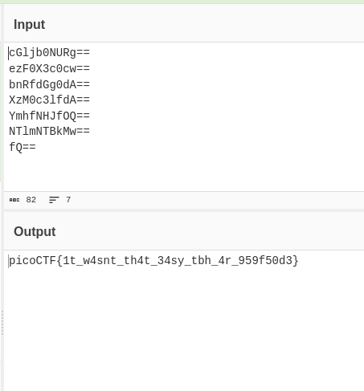

## Verify, Started and Finished 14 July 2025

I ssh'ed into the server and utilized the hints. Now I know that checksum and SHA256 is used the verify integrity of a file.

`sha256sum ./checksum.txt ./files/*`

Now I can view all the checksum from all files now I have to find one with the correct checksum, a file which checksum matches the content of checksum.txt. Grep to the rescue

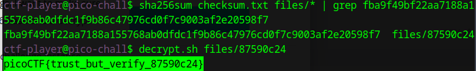