+++
date = '2025-07-27T22:28:41+07:00'
draft = false
title = 'PicoCTF'
tags = ['english', 'it']
toc = true
+++
## **SPOILER**
I don't recommend you read this article before you _actually_ try to solve some of the problems! Try your best first dude. You won't learn anything if you just jump to the answer without any thinking.

## Flag
Here's my write-up of my solutions when I try to solve some of PicoCTF's problems. You can use `Ctrl+F` to search. I will try my best to explain my thought process. I actually solved some of them but I want to document my solution so that people know. The flag will be in the form of picoCTF{flag}.

I'll try to solve the easy ones.

## IN RANDOM ORDER/DIFFICULTY

### DISKO 1, Started and Finished 7 July 2025
We're challenged to find the flag in a disk image. To download the disk image, we use `wget` command and put in the url.


As we can see, the disk image is in the format of `dd.gz` to it's compressed in a gzip format. First, I think we should try to unzip it.

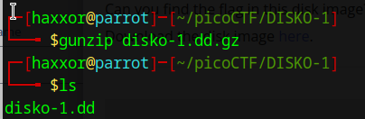

And I happened to know that we can use `strings` command to find human-readable string in a byte-type file


### Fantasy CTF, Started and Finished 7 July 2025
First, I tried to run the command provided.

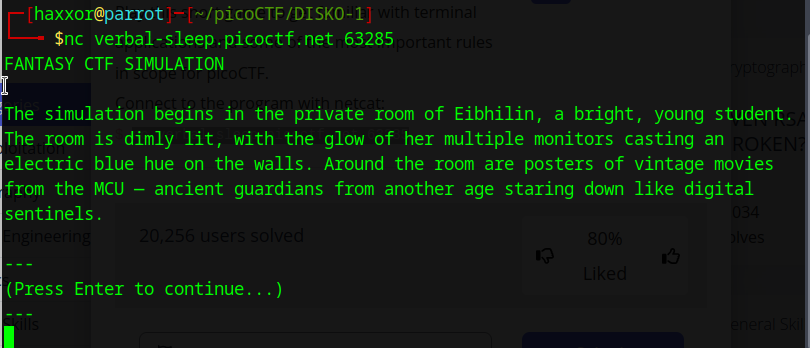

I was shown a story...I'll try to follow along. And after trials and errors, it gives me the flag


### RED, Started and Finished 7 July 2025

So I downloaded the `red.png` and checked the metadata

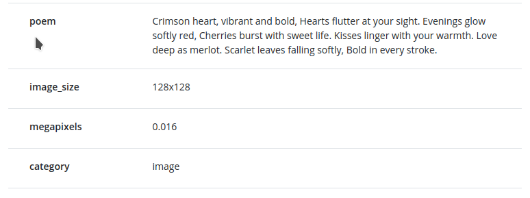

What? A poem? I tried to list all capital letters which gave me "CHECK LSB". I searched for "lsb in image" and DuckDuckGo returned results about Least Significant Bit


I went to Cyberchef and put `Extract LSB` to my recipe. From the hint, `Red?Ged?Bed?Aed?` it's provided that the color pattern is RGBA

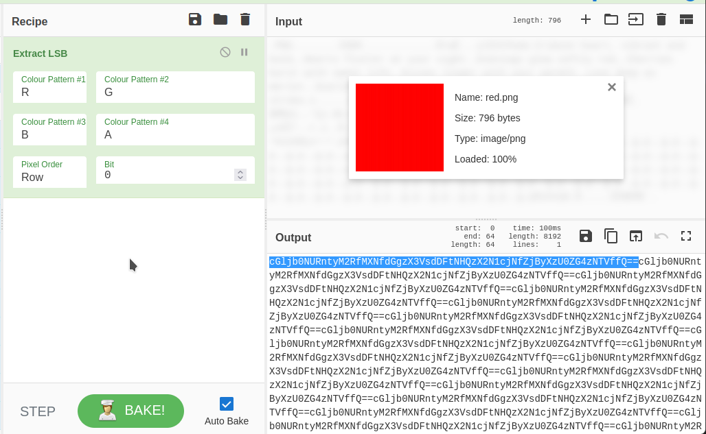

I noticed that from the output there's a repeating pattern. I suspect that it's a Base64


### rust fixme 1, Started 7 July 2025, Finished 9 July 2025
I downloaded the file using wget and extracted it using gunzip and tar


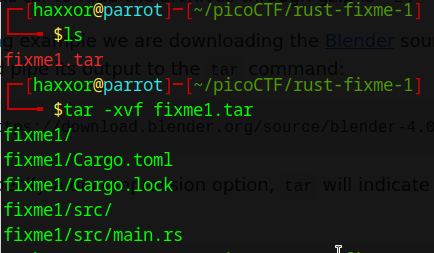

OK, but first we have to install Rust, just follow the instruction from [this page](https://www.rust-lang.org/tools/install)


Great, the errors are displayed. Now it's time to edit. I added a semicolon, corrected "return" statement, and fixed println. Unfortunately my VM in homelab ran out of memory and I had to fix reboot it. We're back to VM in my PC because well...my homelab has insufficient RAM.

I'm back, let's continue. From my little programming experience (C mainly), I had to make sure that every line ends with semicolon (;), if we want to exit from a function use "return". For the println part, I searched and found that I had to use curly braces ({}). To compile, execute `cargo build` in the working directory and the compiled file is in `./target/debug`.

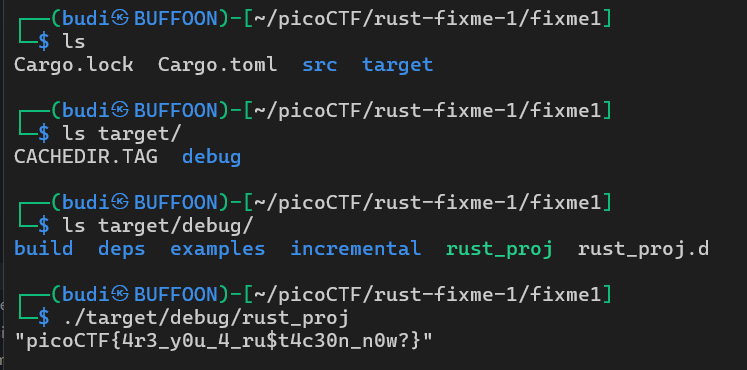

### rust fixme 2, Started 9 July 2025
First, the spadework just like _rust fixme 1_

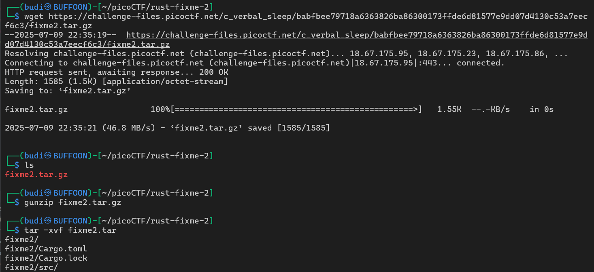

I like to build/compile the project and then see the errors.

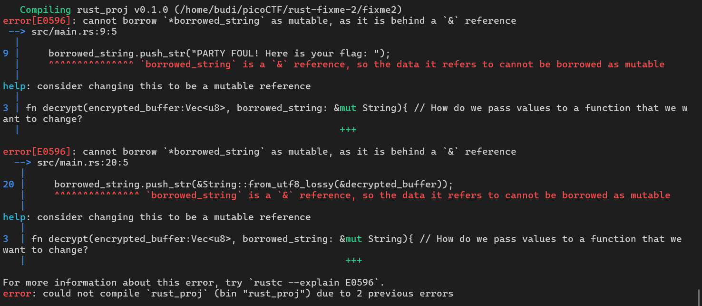

And from the errors we got the hint. I fixed some of them. Another error.

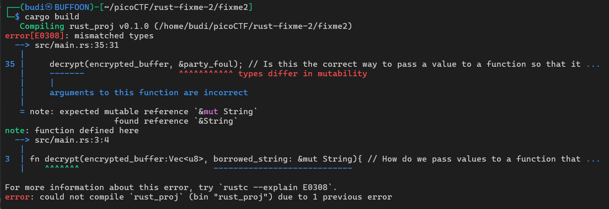

(To be continued)

### Binary Search, Started and Finished 9 July 2025

I immediately ssh'ed to the instance. I had to guess a number ranging from 1 to 1000 under 10 guesses. Hinted from the title, I had to add the upper range and lower range and divide it by 2, effectively doing a Binary Search.

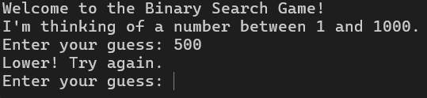

Now we do between 1 and 500

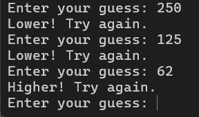

Fast forward, it took me 10 guesses, whew

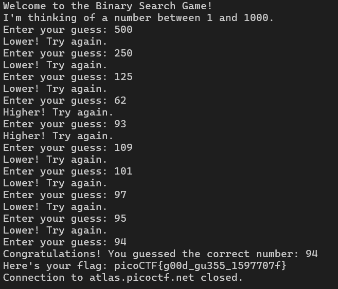

### WebDecode, Started and Finished 9 July 2025

I was given a website and I had to find it using web inspector just like the detail of the problem suggested. I tried inspecting `index.html` and found nothing. But something caught my eye in `about.html`

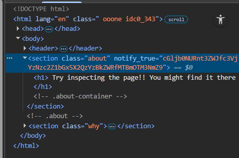

Yeah it must be base64 again.

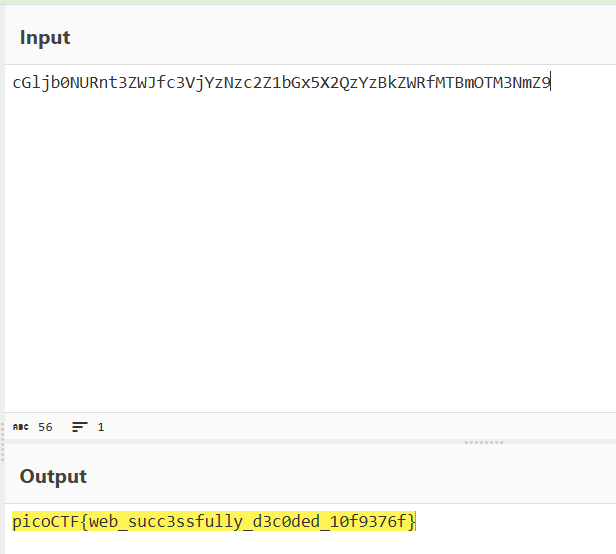

### Ph4nt0m 1ntrud3r, Started and Finished 14 July 2025

I was given a PCAP file and it's about network traffic. I didn't know a damn thing about it but from my conscience I knew it has something to do with Wireshark. So I opened it in Wireshark.

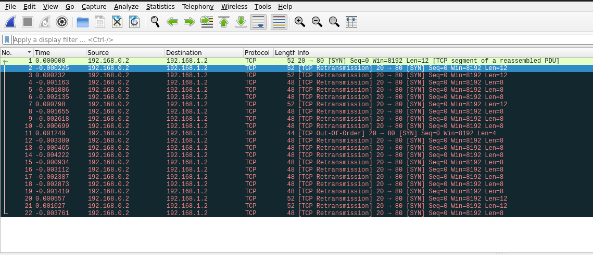

From the hint, it's all about time so I sorted it by time and starts decoding the last part of each payload _from the bottom_ and I got this

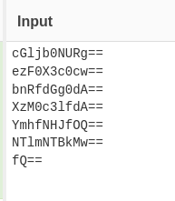

And it's suspiciously a base64 and I decoded it with cyberchef and got the flag

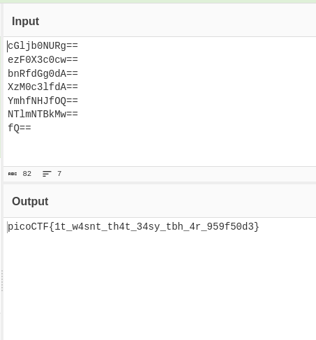

### Verify, Started and Finished 14 July 2025

I ssh'ed into the server and utilized the hints. Now I know that checksum and SHA256 is used the verify integrity of a file.

`sha256sum ./checksum.txt ./files/*`

Now I can view all the checksum from all files now I have to find one with the correct checksum, a file which checksum matches the content of checksum.txt. Grep to the rescue

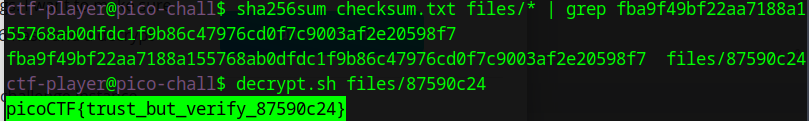

### Scan Surprise, Started and Finished 15 July 2025

I just downloaded the zip, extracted it, and scan the flag.png using online scanner

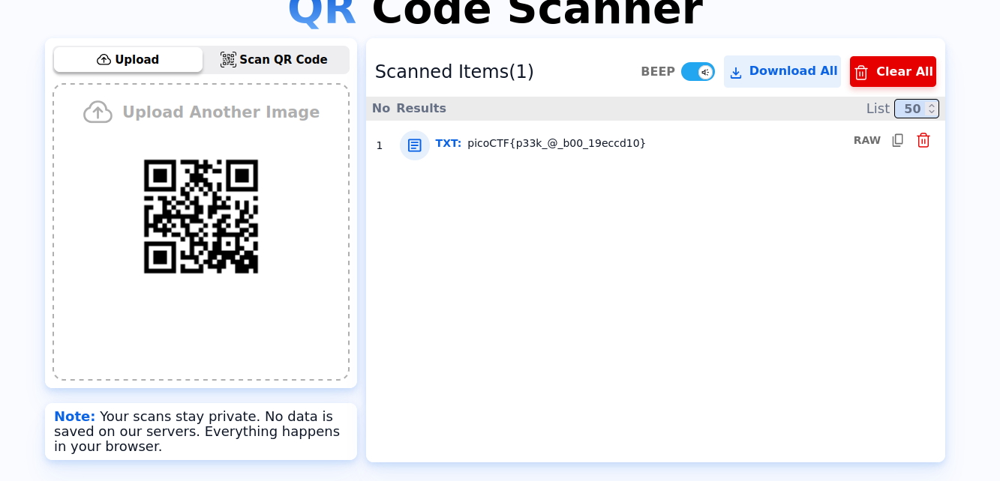

### Secret of the Polyglot, Started and Finished 15 July 2025

I downloaded the .pdf file and from the description `they're getting conflicting information on what type of file it is` I checked using `file` command.

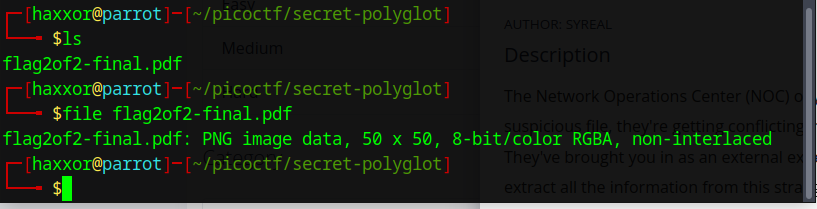

I decided to copy the file and changed the file extension.


### CanYouSee, Started and Finished 15 July 2025

I downloaded the .zip file and extracted it, the result is a single .png file named "ukn_reality". My instinct says to check the metadata.

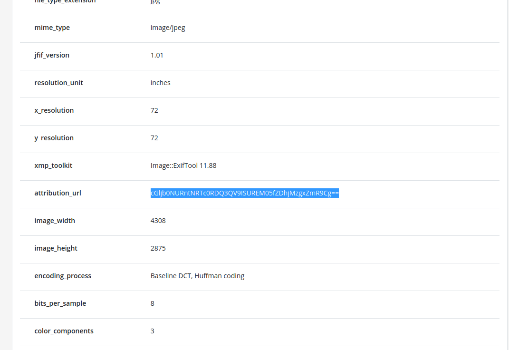

Another base64!

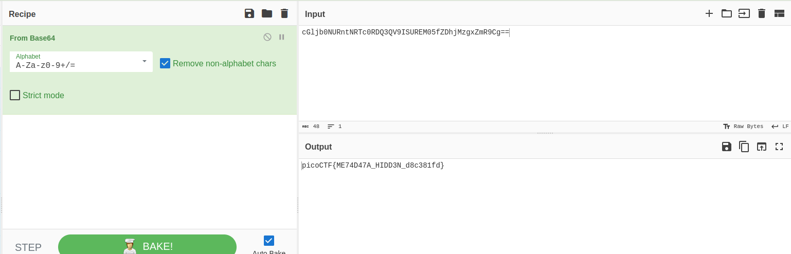

### information, Started and Finished 15 July 2025

Similar to the previous "CanYouSee" but now it's in the license field

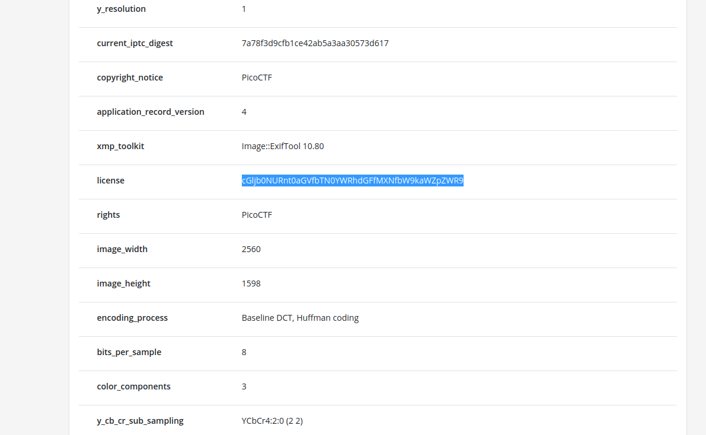


### Glory of the Garden, Started and Finished 15 July 2025

The spadework is similar to _information_ but this time I used "To Hexdump" in Cyberchef and use the image as input

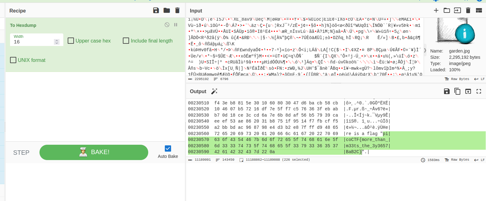

### DISKO 2, Started and Finished 15 July 2025

I downloaded the disk and checked it using `fdisk -l` command

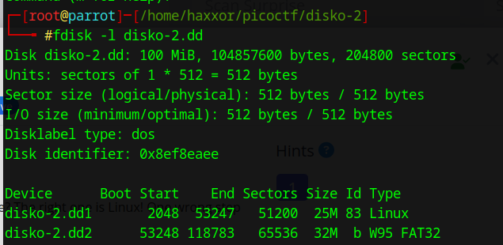

From the challenge description, it looked like the flag is in the Linux partition so I extracted it using dd command

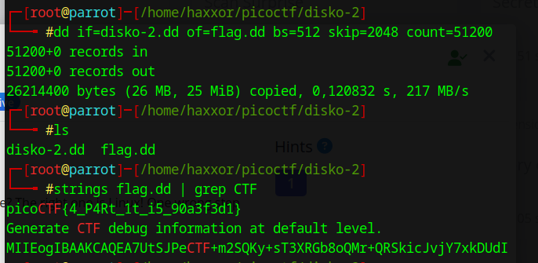

if denotes input file, of is output file, bs is block size (normally 512kB), we skip to the starting sector of Linux which is 2048 and count for 51200 sectors.

### flags are stepic, Started and Finished 16 July 2025

I started the instance and checked the hint...okay so I had to use my geography knowledge for this one :P. And I found this flag

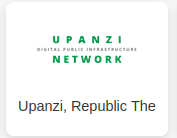

There's no nation named Upanzi and it's actually a research network in Africa by CMU :\). I downloaded the image and found that I had to use a python library called "Stepic" to decrypt the message. Here's my script

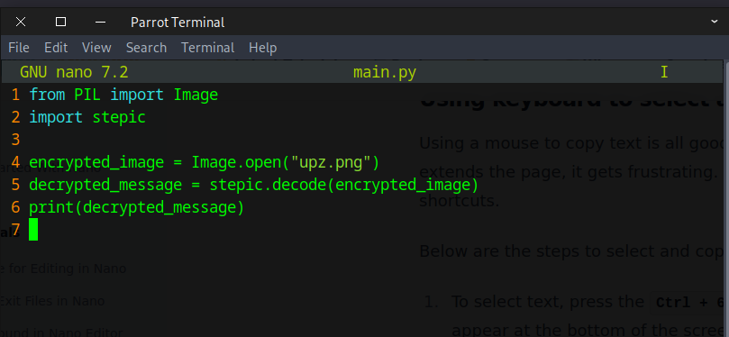

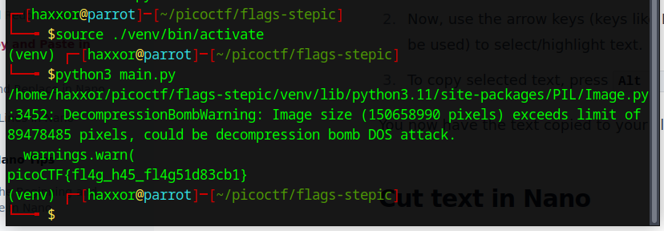

### Event-Viewing, Started and Finished 16 July 2025

I downloaded the .evtx file and browsed a little bit to gain knowledge :P. Eventually I found [this site](https://exploit-notes.hdks.org/exploit/windows/forensics/windows-xml-eventlog/)

I parsed the event log to .xml instead of .txt

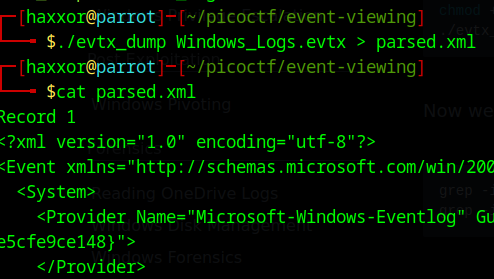

There were about 8000 records and from the description I had to find 3 correct records. I'm kind of damned. From the description I knew that there should be an event ID associated with program installation. I searched a bit and [found 11707](https://learn.microsoft.com/en-us/answers/questions/983008/eventid-that-logs-software-installation-on-worksta). And just below the first 11707 (the next record), I found the first part of the flag, encoded in base64

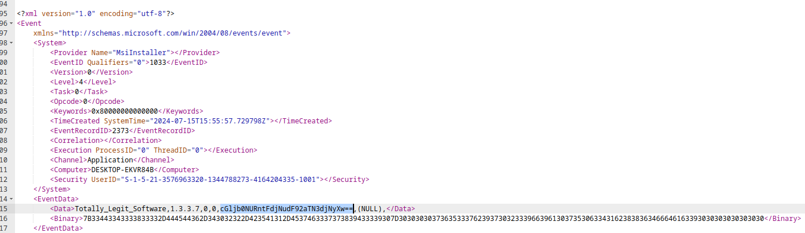

I decided to change the search (Ctrl+F) query to `Totally_Legit_Software` and after some clicking found the second part. 

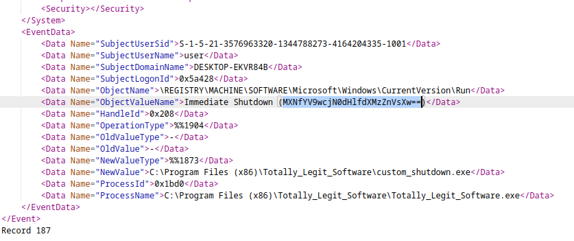

I changed the search query to `shutdown` and finally found the third part!

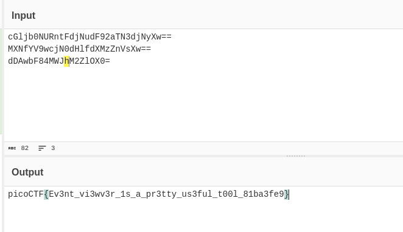

### Find and Open, Started and Finished 16 July 2025

This one is kind of tricky...no, very tricky. I imported the .pcap file to WireShark and found this suspicious packet

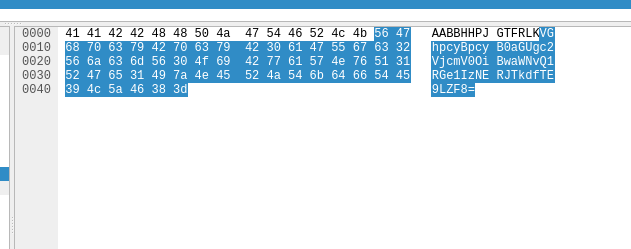

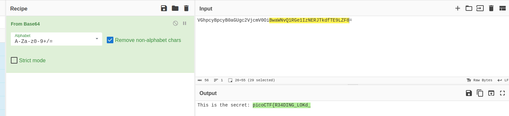

And all I had to do was to put half of the flag as password to extract flag.zip

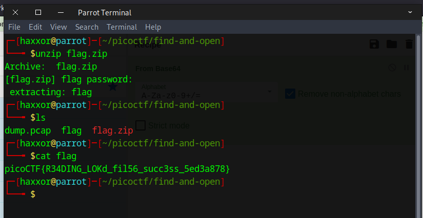

### File types, Started and Finished 17 July 2025

This one is troublesome. Flag.pdf can't be opened by normal pdf viewer

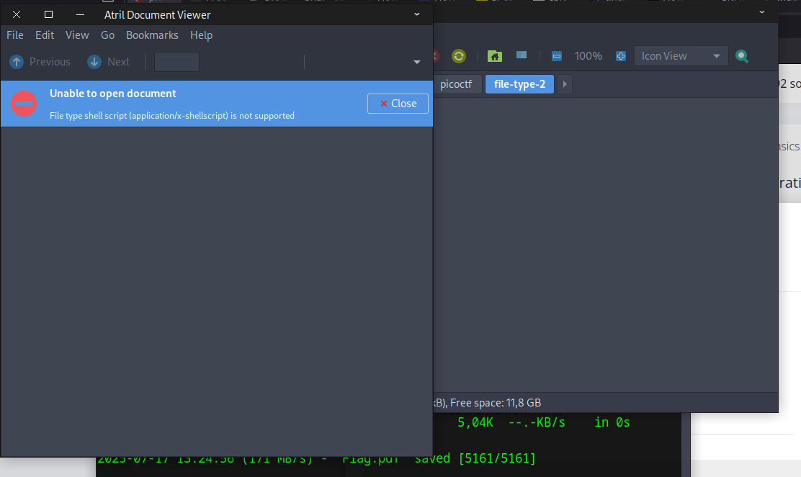

Actually it's a .shar file

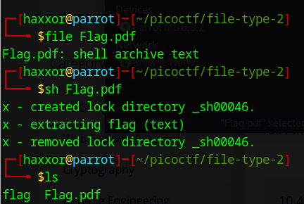

I extracted it and the flag is still nested. Here's the plan, I'll show you my terminal and explain it afterwards.

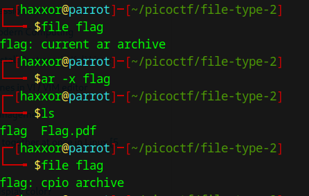

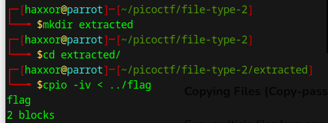

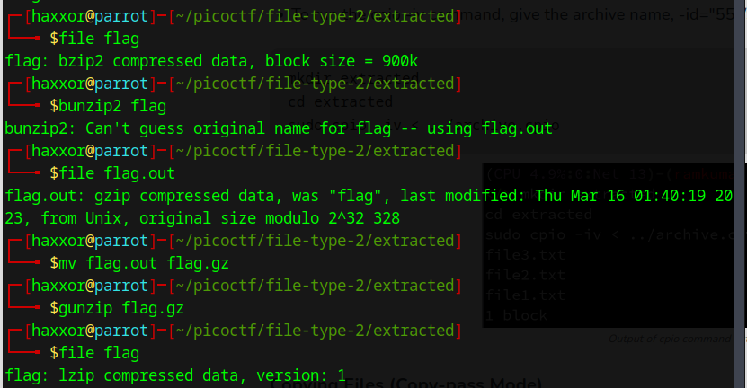

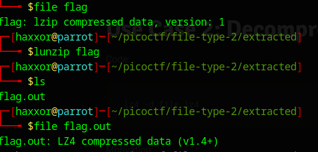

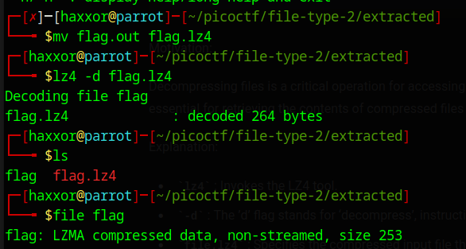

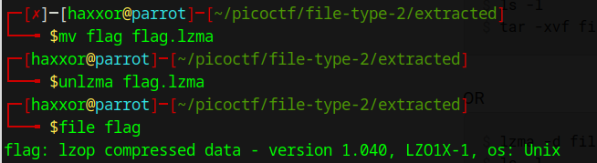

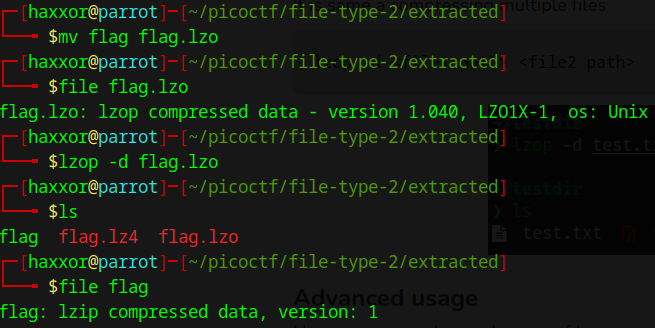

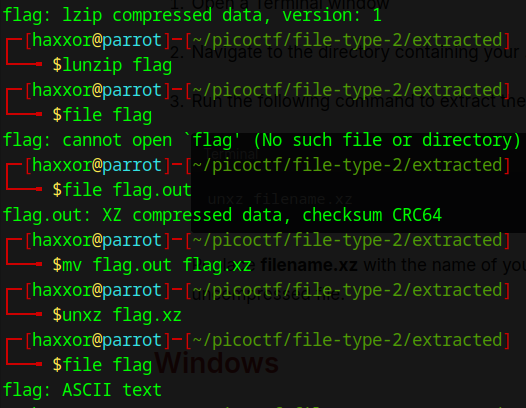

FINALLY!

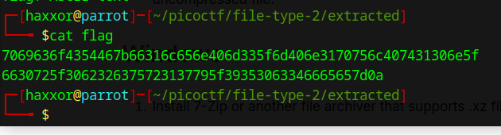

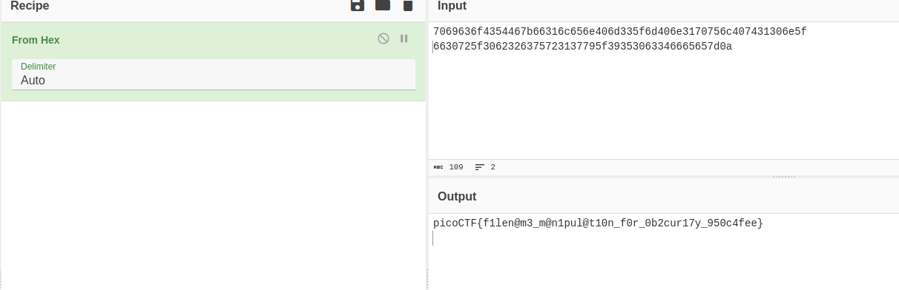

So basically the flag is nested and compressed many times to different format each time. What I did is extracted it to the purest form. I opened this many tabs to find the commands ROFL.

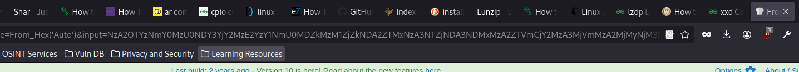

### Enhance!, Started and Finished 18 July 2025

I downloaded the image and used Firefox, found this

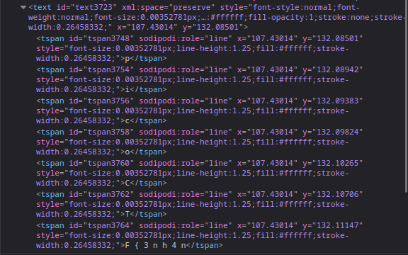

### extensions, Started and Finished 19 July 2025

Just change the extension from .txt to .png dude. You also can check using file command.


### So Meta, Started and Finished 19 July 2025

I just...checked the metadata


### What Lies Within, Started and Finished 19 July 2025

This time I used Cyberchef and from the image I immediately knew it was a stego.


### St3g0, Started and Finished 19 July 2025

Similar to what lies within.


### Mod 26, Started and Finished 20 July 2025

From the description, I knew it was a ROT13


### 13, Started and Finished 20 July 2025

Same as Mod 26


### hashcrack, Started and Finished 20 July 2025


It's so easy, actually. You can use [this tool](https://hashes.com) to identify and crack the password. The first hash was using MD5 and the password is _password123_, the second one was SHA1, _letmein_, and the final one was SHA256, _qwerty098_

### interencdec, Started and Finished 20 July 2025

I dowloaded the file and cat'd it


base64, I assumed


I extracted the string enclosed by \' and got something interesting


### The Numbers, Started and Finished 20 July 2025

The picture is this


Heh, a piece of cake! The algorithm is called "A1Z26" and the number itself represents the alphabet order, A is 1, B is 2, etc.


### rotation, Started and Finished 21 July 2025


### vigenere, Started and Finished 21 July 2025


### Sleuthkit Intro, Started and Finished 21 July 2025

I downloaded the file, gunzipped it and this time I used `mmls` command to check the length of a partition


### Sleuthkit Apprentice, Started and Finished 22 July 2025

It's similar to intro but with extra steps. This time I had to list the file name using `fls`


I tried to list the /home directory but it was empty


I tried to check the root and bingo!


### Disk, disk, sleuth! II, Started and Finished 22 July 2025

Similar to the previous apprentice problem.


`picoCTF{f0r3ns1c4t0r_n0v1c3_82489dbf}`

### Operation Orchid, Started and Finished 22 July 2025

I downloaded the disk image and gunzipped it, just like usual. I checked it with `mmls` and the offset is now 411648


Now the file in encrypted, _enc_ means encrypted but we can always check the `.ash_history`


Here's the tricky part, I had to find a way to copy the file (or the content of the file) flag.txt.enc from disk image to the current working directory


Now for the decryption...


### Guess My Cheese (Part 1), Started and Finished 24 July 2025

I had to try many times for this one to get a lucky encryption strategy.


I noticed that it might be a Caesar Cipher, let's confirm


Let's try another one. by the way I had to browse for kinds of cheese


Now for the moment of truth


### basic-mod1, Started and Finished 24 July 2025

Here's the script I used to solve the problem

```
msg = "PUT THE ENCRYPTED CONTENT HERE"

str_list = msg.split(" ")
num_list = []

for str1 in str_list:
    num_list.append(int(str1) % 37)
    
result = ""

for num in num_list:
    if num >= 0 and num <= 25:
        result = result + chr(num + 97)
    elif num >= 26 and num <= 35:
        result = result + chr(num+22)
    elif num == 36:
        result = result + "_"

print("picoCTF{" + result + "}")
```

### basic-mod2, Started and Finished 24 July 2025

```
msg = "PUT ENCRYPTED CONTENT HERE"
def modInverse(A, M):
    for X in range(1, M):
        if (((A % M) * (X % M)) % M == 1):
            return X
    return -1
str_list = msg.split(" ")
num_list = []
inv_mod_list = []
for str1 in str_list:
    num_list.append(int(str1) % 41)
for num in num_list:
    inv_mod_list.append(modInverse(num, 41))
result = ""
for num in inv_mod_list:
    if num >= 1 and num <= 26:
        result = result + chr(num + 96)
    elif num >= 27 and num <= 36:
        result = result + chr(num+21)
    elif num == 37:
        result = result + "_"

print("picoCTF{" + result + "}")
```
### caesar, Started and Finished 27 July 2025

I downloaded the message


Okay let's do some experiment using ROT


### Flags, Started and Finished 27 July 2025

I downloaded the file and it had shown me a bunch of flags with curly braces


I just found that that it's International Maritime Signal Flags and I tried to decrypt it using [this wikipedia](https://en.wikipedia.org/wiki/International_maritime_signal_flags). Notice that for number parts of the flag, NATO version of numbers is used.


### Tapping, Started and Finished 27 July 2025

It's just a morse code!


### Easy1, Started and Finished 27 July 2025

It's just a Vigenere Cipher!

